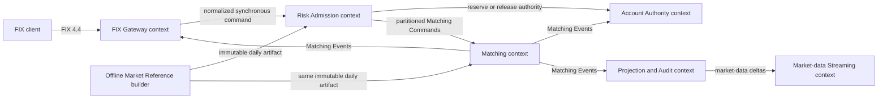

# SimpleMatch domain context

SimpleMatch models a cash-equity order flow in which an external FIX request is normalized, checked
for account and market eligibility, durably admitted, matched deterministically, and projected to
downstream views. The codebase is a single repository, but each service owns a distinct business
capability and language. Spring, QuickFIX/J, protobuf, Kafka, and JDBC are implementation mechanisms
around those capabilities; they are not the domain model.

## Context map

| Upstream context | Downstream context             | Relationship and translation rule                                                                                         |
|------------------|--------------------------------|---------------------------------------------------------------------------------------------------------------------------|
| FIX client       | FIX Gateway                    | Anti-corruption layer. FIX tags are parsed into gateway-local values before business submission.                          |
| FIX Gateway      | Risk Admission                 | Customer/supplier synchronous boundary. The gateway supplies stable command and FIX identities; risk owns the decision.   |
| Risk Admission   | Account Authority              | Risk requests idempotent reservation work; account-service owns balances, positions, reservations, and their transaction. |
| Market Reference | Risk Admission / Matching      | Conformist startup boundary. Both consumers load the same approved daily artifact bytes and do not reinterpret official source rows independently. |
| Risk Admission   | Matching                       | Published `MatchingCommand` language over one explicitly assigned Kafka partition. Admission success precedes asynchronous matching. |
| Matching         | Account Authority / Projection / FIX Gateway | Published `MatchingEvent` language. Every critical consumer owns durable idempotency and its local state transition. |
| Projection and Audit | Market-data Streaming       | Rebuildable per-instrument snapshots and deltas; streaming never becomes a command path.                                  |

## Bounded contexts and ownership

### FIX Gateway

Owns FIX sessions, inbound normalization and gateway-local validation, the local WAL, and outbound
FIX rendering. Missing or malformed normalized command values receive a protocol-level rejection
before WAL append and before Risk Admission; valid normalized commands are appended before
downstream submission. `InboundFixMessageHandler` is the public message-type dispatcher and
depends only on the new-order and cancel path handlers. The new-order handler delegates preparation,
WAL-before-risk admission, accepted response, and rejection rendering to named gateway-local
modules; Spring composes those concrete modules at the ingress seam.
`FixOrderSnapshot` and
`FixExecutionIdentity` are gateway anti-corruption-layer values, not shared order-domain objects. A
FIX field may be preserved for audit without being promoted into the internal ubiquitous language.

### Risk Admission

Owns command validation, the admission business key, durable accepted or rejected outcomes, the
admission journal, and the admission outbox. `AdmissionCommand` is composed from `Identity`,
`Order`, `FixIdentity`, and `RoutingReference`.
`SubmissionResult` is composed from submission reference, FIX identity, storage-safe identity, and
outcome. An accepted outcome has no rejection; a rejected outcome has a stable code and detail.
Persisted FIX identity and its surrogate state travel together. Persistence rows may remain flat
externally, but adapters must reconstruct these domain values before invoking business behavior.

### Account Authority

Owns account limits, positions, reservations, releases, and fill application. `ReserveOperation`,
`ReleaseReservationOperation`, and `ApplyFillOperation` are application commands.
`ReservationIdentity`,
`ReservationRequestIdentity`, `ReservationTerms`, and `ExecutionFill` make identity and
monetary/quantity roles explicit before the transaction starts. The application service owns the
transaction and state-dependent invariants.

### Matching

Owns deterministic per-instrument order books, time/price priority, fill generation, cancellation,
and expiry. Fifteen fixed Matching owners map StatefulSet ordinal `N` to Kafka partition `N`; each
owner holds at most 150 instrument order books. Kafka `matching.commands` is the authoritative
ordered input journal. The native single-writer core receives commands through a preallocated input
ring and emits results through a preallocated output ring; Kafka ingress, publication, storage, and
operational status remain outside the core. Matching does not synchronously depend on projections,
market-data clients, PostgreSQL, or account persistence after an order has been admitted.

### Market Reference

Owns the offline acquisition, normalization, validation, and construction of one immutable Market
Reference Artifact for each Asia/Taipei trading day. The artifact contains reusable market rules,
instrument facts and eligibility, and complete stable routing assignments for all Phase 1 eligible
XTAI and ROCO regular-board common stocks. Risk Admission and all Matching owners load the same
approved file bytes at startup. Market Reference is not a runtime service and owns no outbox, Kafka
topic, consumer projection, or trading-path lookup. A future trading day's artifact may assign an
instrument to a different route, but the current trading session's topology and assignments remain
immutable after readiness opens. Runtime market-data projection and client streaming are outside
this boundary.

### Operational Coordination

Owns the trading readiness and admission decision by composing independently owned facts: the
approved artifact identity, Risk status, all 15 Matching ownership/recovery statuses, Kafka
topology, and critical-consumer progress. In Phase 1 this capability lives inside the single FIX
Gateway application boundary; it is not a standalone service. Kubernetes and Kafka adapters
translate platform observations into domain status values. If a required dependency fails after
open, the Gateway pauses new admission or interrupts the market according to severity without
mutating the artifact or reassigning a partition. Recovery never reopens admission automatically.

### Market-data Streaming

Owns rebuildable runtime market views derived from Matching execution and book-change facts, the
latest Redis snapshot with sequence metadata, and client stream delivery. Its planned baseline is
the last trade and top-five book for each instrument, including snapshot-before-delta delivery,
gap detection, resynchronization, and slow-consumer handling. Historical analytics and broader
per-instrument metrics such as OHLCV, turnover, and VWAP require a separate specification and are
not part of transition cleanup. Market-data Streaming does not own instrument reference facts,
Routing Policies, order books, executions, or durable audit history.

### Query

Owns required Phase 1 read-only views for order state, executions, account summaries, and the active
Market Reference Artifact. Its PostgreSQL and Redis projections are rebuildable downstream views,
never command authority. Query does not read another service's database, join service-owned schemas,
or make admission, reservation, Matching, or delivery decisions. A Query outage degrades reads but
does not pause the trading path.

### Shared platform configuration

`shared-java/simplematch-config` owns independently bindable environment, Kafka, PostgreSQL, Redis,
gRPC, routing, observability, and market capability records under the existing `simplematch.*`
namespace. Services consume only the capabilities they need; gateway-local paths, feature flags,
and resilience policy remain owned by QuickFIX Gateway. The former wide `PlatformProperties` root
facade has been removed, so shared startup validation and persistence context tests use the final
capability interfaces directly.

### Projection and Audit

Owns rebuildable query projections and audit integration. Projection state is downstream of
authoritative lifecycle events and must not become a second command path.

## Ubiquitous language

| Term                   | Meaning                                                                                               | Owner                                        |
|------------------------|-------------------------------------------------------------------------------------------------------|----------------------------------------------|
| Admission              | Durable decision that a normalized order may enter the ordered matching path.                         | Risk Admission                               |
| Admission aggregate root | One Risk Admission lifecycle for a command identity, from pending intent to accepted or rejected outcome. | Risk Admission                               |
| Submission             | One normalized request evaluated and persisted as accepted or rejected.                               | Risk Admission                               |
| Admission business key | FIX sender, target, trading day, command category, and client-order identity used for idempotency.    | Risk Admission                               |
| Reservation            | Account-owned authority held for an admitted order.                                                   | Account Authority                            |
| Account limit          | Daily notional authority for one account and trading day, including its reserved and utilized amounts. | Account Authority                            |
| Account position       | Symbol-level inventory authority for one account, including long, short, and reserved quantities.    | Account Authority                            |
| Execution fill         | One idempotent matched quantity at one execution price.                                               | Matching produces; Account Authority applies |
| Release                | Terminal removal of remaining reserved authority.                                                     | Account Authority                            |
| Market snapshot        | Versioned set of instrument eligibility and trading rules.                                            | Market Reference                             |
| Routing policy         | Complete stable assignment of every eligible instrument to one of 15 fixed Matching partitions for one trading day. | Market Reference                             |
| Market Reference Artifact | Immutable canonical JSON containing metadata, market rules, instrument facts, eligibility, and the Routing Policy; Risk and Matching load the exact same bytes. | Market Reference                             |
| Artifact identity      | One trading day plus the SHA-256 of the exact final artifact UTF-8 bytes; it is supplied outside the JSON. | Market Reference                             |
| Local production-like gate | Repository-owned certification boundary that runs the retained trading path with local images and production-shaped dependency contracts; it does not mean external promotion has occurred. | Cross-context                                |
| Local resilience lab | One repository-owned multi-node Kubernetes environment used to exercise workload placement, controlled failures, recovery, replay, fencing, and safe degradation. It is not evidence of physical-host, availability-zone, distributed-storage, or production-platform high availability. | Operational Coordination |
| Deployment template     | A staging or production deployment description with explicit environment and image placeholders; it is prepared for promotion but is not local certification evidence. | Operational Coordination                    |
| Local image identity    | The digest observed from the local container runtime for one build; it identifies local evidence but is not an approved registry release identity. | Cross-context                                |
| Phase 1 Trading Release | First complete pre-release trading-system boundary for the accepted XTAI/ROCO continuous-trading scope, including required trading, durability, read, deployment, security, certification, and cleanup capabilities. It is distinct from numbered refactor phases. | Cross-context                                |
| Trading session        | One coordinated Phase 1 regular-board lifecycle from Open Barrier through Close Barrier for one Asia/Taipei trading day. | Operational Coordination                    |
| Open Barrier           | Ordered command in every Matching partition that establishes the trading session, artifact, algorithm version, and replay baseline. | Risk Admission publishes; Matching applies  |
| Close Barrier          | Ordered command in every Matching partition after admission drains; it expires remaining ROD orders and closes that partition deterministically. | Risk Admission publishes; Matching applies  |
| Matching Command       | Stable-identity new-order, cancel, Open Barrier, or Close Barrier input carried by `matching.commands`. | Risk Admission                               |
| Matching Event         | Deterministic Matching result carried by `matching.events`, including trade, rested, cancelled, and expired facts. | Matching                                    |
| Command identity       | Stable identity of one requested Matching action; transport redelivery never creates a new command identity. | Ingress owner                                |
| Order identity         | Stable identity of one order throughout creation, matching, cancellation, and expiry.                   | Risk Admission creates; contexts reference  |
| Event identity         | SHA-256 identity of one command output slot within a trading session and partition.                     | Matching                                    |
| Trade identity         | SHA-256 identity of one deterministic match slot within a command.                                      | Matching                                    |
| Output index           | Zero-based order of all externally published events produced by one Matching Command.                   | Matching                                    |
| Match index            | Zero-based order of only the trades produced by one new-order Matching Command.                          | Matching                                    |
| Maker                  | For one trade, the order already resting in the order book and providing liquidity.                     | Matching                                    |
| Taker                  | For one trade, the incoming order that removes resting liquidity; the role is per trade, not permanently buy or sell. | Matching                                    |
| Critical consumer      | Consumer whose failed record cannot be skipped because it owns permanent trade, account, or FIX-delivery effects. | Consuming context                            |
| Quarantine             | Durable evidence that a critical consumer stopped before a record whose identity, payload, sequence, or schema cannot be applied safely. | Consuming context                            |
| Partition Ownership Permit | Infrastructure-derived permission that allows one `matching-N` runtime to process partition `N`; the core does not depend on Kubernetes types. | Matching infrastructure                     |
| Matching Fleet Status  | Operational status of all 15 Matching owners, including identity, permit, artifact, recovery, lag, and quarantine. | Matching infrastructure                     |
| Trading System Status  | Gateway-owned decision value combining Risk, Matching Fleet, Kafka, and critical-consumer readiness into open, pause, or interrupt eligibility. | Operational Coordination                    |
| Trading readiness barrier | Operational boundary that opens only when the daily artifact identity, trading session, schemas, 15-partition topology, Matching ownership, and critical-consumer health all agree. | Operational Coordination                    |
| Regular trading session | Single continuous cash-equity trading period from market open to market close; it is not divided into morning and afternoon sessions. | Market Reference                             |
| Market instrument      | Instrument known to a market snapshot, with complete trading rules and explicit eligibility. It may be known but ineligible. | Market Reference                             |
| Eligibility reason     | Market Reference explanation of whether a known instrument is tradable. Unsupported is valid snapshot data; malformed is not. | Market Reference                             |
| Instrument order book capacity | Maximum number of eligible market instruments whose order books one Matching route may own.     | Matching                                    |
| Last-trade view        | Rebuildable per-instrument view of the latest published execution, with sequence metadata for consistent delivery. | Market-data Streaming                        |
| Top-five book view     | Rebuildable per-instrument view of the five best price levels on each side, derived from Matching book-change facts. | Market-data Streaming                        |
| WAL record             | Replay-safe gateway persistence representation of inbound FIX intent; not an aggregate.                | FIX Gateway                                  |
| Journal row            | Persistence representation of the Admission aggregate; not a transport-facing contract.              | Risk Admission                               |
| Outbox record          | Infrastructure representation used to publish a domain/integration event atomically with local state. | Producing context                            |

## Modeling rules

1. Use a value object when a value has an invariant, a stable domain name, or the same Java
   representation as another value that must never be substituted for it. `OrderId`, `AccountId`,
   `FillQuantity`, and `FillPrice` therefore use different types even when their wire forms are
   `String` or `BigDecimal`.
2. Use an application command when a caller is asking one context to perform one use case. The
   command groups values by meaning, not merely to satisfy a parameter-count rule.
3. Keep domain values free of Spring, JDBC, protobuf, QuickFIX/J, and Kafka types. Adapters perform
   explicit mapping at context boundaries.
4. A wide protobuf message, SQL row, WAL record, or event envelope is not automatically a domain
   smell. It becomes a design problem when positional fields cross into business behavior without
   translation.
5. Do not introduce a repository-wide enterprise domain model. Share only stable cross-context
   contracts and primitive value semantics; each bounded context owns its own aggregate and
   language.
6. Application services own business transactions. Domain values validate context-free invariants
   before a transaction; locked aggregates and application services validate state-dependent
   invariants inside the transaction.
7. A compatibility adapter may delegate to a typed command temporarily only when it preserves a
   semantic Java interface. Pre-existing wider positional members are migration debt for a
   separately verified slice; new production callers must not use them, and a deprecated positional
   overload is never an accepted exception. PMD's `ExcessiveParameterList` rule is the sole
   automated parameter-count gate.

## Aggregate and consistency boundaries

Account Authority has three separate aggregate roots: Reservation, Account limit, and Account
position. Reservation owns one reservation's lifecycle and quantities; Account limit owns the
daily notional invariant for one account; Account position owns the quantity bounds for one account
and symbol. Reservation lifecycle operations may coordinate a reservation root with the relevant
limit or position root in one local transaction; no single Account root owns every position and
reservation.

`ReservationLifecycle` is the mutable state of one Reservation: remaining and filled quantities,
held authority, outcome, and revision history change together in an account-service transaction.
`Release` ends only unused authority; it never reverses an applied fill or cancels the matching
order that owns the reservation. The lifecycle rejects combinations that conflict with its state:
accepted authority remains allocated, rejection has no fill or held authority and has a stable
reason, release has no remaining or held authority, and an applied reservation is fully filled.

Account limit and Account position retain separate identity, state, and revision values. A daily
notional ledger is not interchangeable with symbol-level inventory, even where their persistence
rows both use an optimistic version and update timestamp.

Risk Admission has one Admission aggregate root per command identity. It owns the normalized order
facts needed for the decision, the alternate admission business key, and the lifecycle from pending
intent to an accepted or rejected outcome. Account reservations and matching orders are separate
context-owned roots; an admission may reference their outcome or publish an accepted decision, but it
does not own their state.

An Admission journal entry composes the validated Admission command, its fixed delivery route, and
its lifecycle. The command retains the ingress routing reference; the delivery route retains the
authoritative Artifact identity and resolved Matching partition as one persisted pair. A new
Admission resolves that pair exactly once before Account Authority work. Every persisted Admission
has both values, and recovery reuses the pair without reconstructing or recomputing either value.
The lifecycle owns state, reservation or rejection outcome, and optimistic revision history. JDBC
alone flattens and rehydrates the journal row, while an admission response remains a separate
projection.
Admission lifecycle outcomes are state-specific: pending has no decision, an accepted new order has
a reservation reference, an accepted cancellation explicitly requires none, and rejection has a
stable nonblank code and detail.
An Admission result is a projection of Admission identity, decision, routing-policy provenance,
and delivery route. It does not duplicate journal revision history or complete order facts.

Each aggregate root owns its state-dependent invariants. `AccountReservation` is changed only
through account-service transaction-owning application methods.
`AccountReservationApplicationService` is the only supported reservation write path; a legacy
direct row writer must not bypass account-limit, position, and outbox coordination.
`AccountLifecycleOutbox` is account-service infrastructure rather than Reservation state. Its event
identity, destination, serialized payload, aggregate reference, and creation time are flattened
only by the outbox JDBC adapter.
The admission journal and outbox are changed atomically inside risk-service-owned transactions.
`OrderAdmissionApplicationService` owns synchronous validation, backpressure, and remote account
reservation orchestration. `PendingAdmissionRecovery` owns scheduled retry orchestration and keeps
remote reservation work outside local transactions; failed pending rows remain eligible for a later
bounded pass. Cross-service calls never extend a database transaction across service boundaries;
retry requires an idempotency identity, and asynchronous consumers own inbox/deduplication state.
These boundaries take precedence over convenience abstractions that would hide transaction
ownership.

## Parameter-interface policy

A semantic parameter group is a named value in its owning context whose fields share a lifecycle or
invariant. PMD's `ExcessiveParameterList` rule is the repository's sole automated parameter-count
gate and retains its existing default threshold of ten. Independently of that numeric gate,
handwritten production Java interfaces should use semantic parameter groups when several values
share one use case, lifecycle, or invariant. Generated sources are excluded; tests use the same
semantic construction vocabulary even when they are not the blocking analysis scope.

An external SQL, protobuf, FIX, WAL, Kafka, or configuration shape may remain wide only outside the
Java interface: its adapter flattens semantic values for output and rehydrates them for input. A
parameter group is accepted only when it adds domain language or owns invariants. Generic
`Parameters`, `Context`, dependency-bag types, builders alone, and deprecated positional Java
compatibility overloads are rejected.
