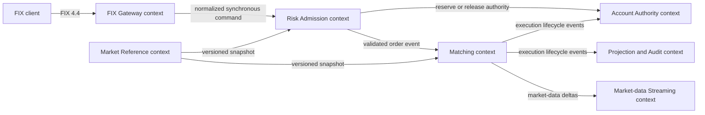

# SimpleMatch domain context

SimpleMatch models a cash-equity order flow in which an external FIX request is normalized, checked
for account and market eligibility, durably admitted, matched deterministically, and projected to
downstream views. The codebase is a single repository, but each service owns a distinct business
capability and language. Spring, QuickFIX/J, protobuf, Kafka, and JDBC are implementation mechanisms
around those capabilities; they are not the domain model.

## Context map

| Upstream context | Downstream context             | Relationship and translation rule                                                                                         |
|------------------|--------------------------------|---------------------------------------------------------------------------------------------------------------------------|
| FIX client       | FIX Gateway                    | Anti-corruption layer. FIX tags are parsed into gateway-local values before business submission.                          |
| FIX Gateway      | Risk Admission                 | Customer/supplier synchronous boundary. The gateway supplies stable command and FIX identities; risk owns the decision.   |
| Risk Admission   | Account Authority              | Risk requests idempotent reservation work; account-service owns balances, positions, reservations, and their transaction. |
| Market Reference | Risk Admission / Matching      | Published language based on a versioned market snapshot. Consumers do not reinterpret source fixtures independently.      |
| Risk Admission   | Matching                       | Published language over ordered Kafka events. Admission success precedes asynchronous matching.                           |
| Matching         | Account Authority / Projection | Published lifecycle events. Each consumer owns idempotency and its local state transition.                                |

## Bounded contexts and ownership

### FIX Gateway

Owns FIX sessions, inbound normalization and gateway-local validation, the local WAL, and outbound
FIX rendering. Missing or malformed normalized command values receive a protocol-level rejection
before WAL append and before Risk Admission; valid normalized commands are appended before
downstream submission. `InboundFixMessageHandler` is the public message-type dispatcher and
depends only on the new-order and cancel path handlers. The new-order handler delegates preparation,
WAL-before-risk admission, accepted response, and rejection rendering to named gateway-local
modules; Spring composes those concrete modules at the ingress seam.
`FixOrderSnapshot` and
`FixExecutionIdentity` are gateway anti-corruption-layer values, not shared order-domain objects. A
FIX field may be preserved for audit without being promoted into the internal ubiquitous language.

### Risk Admission

Owns command validation, the admission business key, durable accepted or rejected outcomes, the
admission journal, and the admission outbox. `AdmissionCommand` is composed from `Identity`,
`Order`, `FixIdentity`, and `RoutingReference`.
`SubmissionResult` is composed from submission reference, FIX identity, storage-safe identity, and
outcome. An accepted outcome has no rejection; a rejected outcome has a stable code and detail.
Persisted FIX identity and its surrogate state travel together. Persistence rows may remain flat
externally, but adapters must reconstruct these domain values before invoking business behavior.

### Account Authority

Owns account limits, positions, reservations, releases, and fill application. `ReserveOperation`,
`ReleaseReservationOperation`, and `ApplyFillOperation` are application commands.
`ReservationIdentity`,
`ReservationRequestIdentity`, `ReservationTerms`, and `ExecutionFill` make identity and
monetary/quantity roles explicit before the transaction starts. The application service owns the
transaction and state-dependent invariants.

### Matching

Owns deterministic per-instrument order books, time/price priority, fill generation, cancellation,
and expiry. It does not synchronously depend on projections, market-data clients, or account
persistence after an order has been admitted.

### Market Reference

Owns validated, versioned instrument and tick-rule snapshots. Its published snapshot is an external
fact consumed by risk and matching, not mutable state jointly owned by those services.

Risk Admission currently owns the configured symbol-to-partition policy for `orders.validated`.
It resolves and durably records a partition before publication so retries retain the same delivery
route; the incoming routing-snapshot reference remains opaque routing-policy provenance, not the
source of that assignment. Moving routing assignment into Market Reference requires a separate
versioned contract, schema migration, and consumer rollout; it is deferred rather than implied by an
admission refactor.

### Projection and Audit

Owns rebuildable query projections and audit integration. Projection state is downstream of
authoritative lifecycle events and must not become a second command path.

## Ubiquitous language

| Term                   | Meaning                                                                                               | Owner                                        |
|------------------------|-------------------------------------------------------------------------------------------------------|----------------------------------------------|
| Admission              | Durable decision that a normalized order may enter the ordered matching path.                         | Risk Admission                               |
| Admission aggregate root | One Risk Admission lifecycle for a command identity, from pending intent to accepted or rejected outcome. | Risk Admission                               |
| Submission             | One normalized request evaluated and persisted as accepted or rejected.                               | Risk Admission                               |
| Admission business key | FIX sender, target, trading day, command category, and client-order identity used for idempotency.    | Risk Admission                               |
| Reservation            | Account-owned authority held for an admitted order.                                                   | Account Authority                            |
| Account limit          | Daily notional authority for one account and trading day, including its reserved and utilized amounts. | Account Authority                            |
| Account position       | Symbol-level inventory authority for one account, including long, short, and reserved quantities.    | Account Authority                            |
| Execution fill         | One idempotent matched quantity at one execution price.                                               | Matching produces; Account Authority applies |
| Release                | Terminal removal of remaining reserved authority.                                                     | Account Authority                            |
| Market snapshot        | Versioned set of instrument eligibility and trading rules.                                            | Market Reference                             |
| Market instrument      | Instrument known to a market snapshot, with complete trading rules and explicit eligibility. It may be known but ineligible. | Market Reference                             |
| Eligibility reason     | Market Reference explanation of whether a known instrument is tradable. Unsupported is valid snapshot data; malformed is not. | Market Reference                             |
| WAL record             | Replay-safe gateway persistence representation of inbound FIX intent; not an aggregate.                | FIX Gateway                                  |
| Journal row            | Persistence representation of the Admission aggregate; not a transport-facing contract.              | Risk Admission                               |
| Outbox record          | Infrastructure representation used to publish a domain/integration event atomically with local state. | Producing context                            |

## Modeling rules

1. Use a value object when a value has an invariant, a stable domain name, or the same Java
   representation as another value that must never be substituted for it. `OrderId`, `AccountId`,
   `FillQuantity`, and `FillPrice` therefore use different types even when their wire forms are
   `String` or `BigDecimal`.
2. Use an application command when a caller is asking one context to perform one use case. The
   command groups values by meaning, not merely to satisfy a parameter-count rule.
3. Keep domain values free of Spring, JDBC, protobuf, QuickFIX/J, and Kafka types. Adapters perform
   explicit mapping at context boundaries.
4. A wide protobuf message, SQL row, WAL record, or event envelope is not automatically a domain
   smell. It becomes a design problem when positional fields cross into business behavior without
   translation.
5. Do not introduce a repository-wide enterprise domain model. Share only stable cross-context
   contracts and primitive value semantics; each bounded context owns its own aggregate and
   language.
6. Application services own business transactions. Domain values validate context-free invariants
   before a transaction; locked aggregates and application services validate state-dependent
   invariants inside the transaction.
7. A compatibility adapter may delegate to a typed command temporarily only when it preserves a
   semantic Java interface. Pre-existing wider positional members are migration debt for a
   separately verified slice; new production callers must not use them, and a deprecated positional
   overload is never an accepted exception. PMD's `ExcessiveParameterList` rule is the sole
   automated parameter-count gate.

## Aggregate and consistency boundaries

Account Authority has three separate aggregate roots: Reservation, Account limit, and Account
position. Reservation owns one reservation's lifecycle and quantities; Account limit owns the
daily notional invariant for one account; Account position owns the quantity bounds for one account
and symbol. Reservation lifecycle operations may coordinate a reservation root with the relevant
limit or position root in one local transaction; no single Account root owns every position and
reservation.

`ReservationLifecycle` is the mutable state of one Reservation: remaining and filled quantities,
held authority, outcome, and revision history change together in an account-service transaction.
`Release` ends only unused authority; it never reverses an applied fill or cancels the matching
order that owns the reservation. The lifecycle rejects combinations that conflict with its state:
accepted authority remains allocated, rejection has no fill or held authority and has a stable
reason, release has no remaining or held authority, and an applied reservation is fully filled.

Account limit and Account position retain separate identity, state, and revision values. A daily
notional ledger is not interchangeable with symbol-level inventory, even where their persistence
rows both use an optimistic version and update timestamp.

Risk Admission has one Admission aggregate root per command identity. It owns the normalized order
facts needed for the decision, the alternate admission business key, and the lifecycle from pending
intent to an accepted or rejected outcome. Account reservations and matching orders are separate
context-owned roots; an admission may reference their outcome or publish an accepted decision, but it
does not own their state.

An Admission journal entry composes the validated Admission command, its fixed delivery route, and
its lifecycle. The command retains order and routing-policy provenance; the delivery route retains
the resolved Kafka partition; the lifecycle owns state, reservation or rejection outcome, and
optimistic revision history. JDBC alone flattens and rehydrates the journal row, while an admission
response remains a separate projection.
Admission lifecycle outcomes are state-specific: pending has no decision, an accepted new order has
a reservation reference, an accepted cancellation explicitly requires none, and rejection has a
stable nonblank code and detail.
An Admission result is a projection of Admission identity, decision, routing-policy provenance,
and delivery route. It does not duplicate journal revision history or complete order facts.

Each aggregate root owns its state-dependent invariants. `AccountReservation` is changed only
through account-service transaction-owning application methods.
`AccountReservationApplicationService` is the only supported reservation write path; a legacy
direct row writer must not bypass account-limit, position, and outbox coordination.
`AccountLifecycleOutbox` is account-service infrastructure rather than Reservation state. Its event
identity, destination, serialized payload, aggregate reference, and creation time are flattened
only by the outbox JDBC adapter.
The admission journal and outbox are changed atomically inside risk-service-owned transactions.
Cross-service calls never extend a database transaction across service boundaries; retry requires an
idempotency identity, and asynchronous consumers own inbox/deduplication state. These boundaries
take precedence over convenience abstractions that would hide transaction ownership.

## Parameter-interface policy

A semantic parameter group is a named value in its owning context whose fields share a lifecycle or
invariant. PMD's `ExcessiveParameterList` rule is the repository's sole automated parameter-count
gate and retains its existing default threshold of ten. Independently of that numeric gate,
handwritten production Java interfaces should use semantic parameter groups when several values
share one use case, lifecycle, or invariant. Generated sources are excluded; tests use the same
semantic construction vocabulary even when they are not the blocking analysis scope.

An external SQL, protobuf, FIX, WAL, Kafka, or configuration shape may remain wide only outside the
Java interface: its adapter flattens semantic values for output and rehydrates them for input. A
parameter group is accepted only when it adds domain language or owns invariants. Generic
`Parameters`, `Context`, dependency-bag types, builders alone, and deprecated positional Java
compatibility overloads are rejected.
