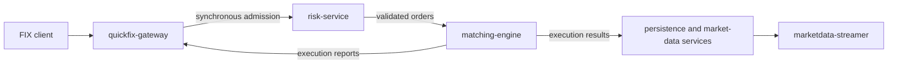

# SimpleMatch

SimpleMatch is a target design for an event-driven matching system: a C++
matching core with Java and Spring Cloud services around it. The repository is
a single polyglot monorepo; Java services use Gradle and native components use
CMake.

This README describes the intended architecture only. It does not claim that
every service, integration, or operational mechanism is already implemented.

## Goals and non-goals

SimpleMatch aims to separate order admission, risk checks, matching, durable
projections, and market-data distribution while retaining a narrow,
deterministic matching boundary. It combines synchronous gRPC admission with
ordered, replayable Kafka event flows and exposes FIX 4.4 through QuickFix/J.

It is not intended to split into separate repositories or to make the matching
path depend on downstream persistence, market-data delivery, or query traffic.

## Intended data flow

The first successful client acknowledgement follows durable admission at
`risk-service`; matching and downstream work continue asynchronously. The
detailed topology, ordering, eventing, and reliability decisions are in the
[target documentation index](services/docs/README.md).

## Service landscape

| Service | Runtime | Intended responsibility |
| --- | --- | --- |
| `quickfix-gateway` | Java, Spring, QuickFix/J | FIX sessions and order admission |
| `account-service` | Java, Spring Cloud | Accounts, limits, positions, and reservations |
| `risk-service` | Java, Spring Cloud | Validation, risk decisions, and durable admission |
| `matching-engine` | C++ | Deterministic order-book matching |
| `persistence` | Java, Spring Cloud | Projections, replay, and audit integration |
| `marketdata-publisher` | Java, Spring Cloud | Versioned daily market-reference snapshots and transactional publication |
| `marketdata-streamer` | Java, Spring Cloud | Public and private streaming views |
| `query-service` | Java, Spring Cloud | Optional internal projection queries |

## Documentation

Use the [target documentation index](services/docs/README.md) to navigate all
technical target specifications.
