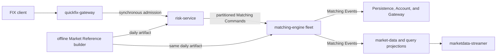

# SimpleMatch

SimpleMatch is a target design for an event-driven matching system: a C++ matching core with Java
and Spring Cloud services around it. The repository is a single polyglot monorepo; Java services use
Gradle and native components use CMake.

This README describes the intended architecture only. It does not claim that every service,
integration, or operational mechanism is already implemented.

## Goals and non-goals

SimpleMatch aims to separate order admission, risk checks, matching, durable projections, and
market-data distribution while retaining a narrow, deterministic matching boundary. It combines
synchronous gRPC admission with ordered, replayable Kafka event flows and exposes FIX 4.4 through
QuickFix/J.

It is not intended to split into separate repositories or to make the matching path depend on
downstream persistence, market-data delivery, or query traffic.

## Intended data flow

The first successful client acknowledgement follows durable admission at
`risk-service`; matching and downstream work continue asynchronously. The detailed topology,
ordering, eventing, and reliability decisions are in the
[target documentation index](services/docs/README.md).

## Service landscape

| Capability | Runtime | Intended responsibility |
| --- | --- | --- |
| Offline Market Reference builder | Repository CLI/tool | Official-source validation, stable routing, and one approved daily artifact |
| `quickfix-gateway` | Java, Spring, QuickFIX/J | FIX sessions, durable lifecycle delivery, and operational admission |
| `account-service` | Java, Spring Cloud | Accounts, limits, positions, reservations, and Matching-event application |
| `risk-service` | Java, Spring Cloud | Artifact validation, risk decisions, durable admission, and Matching-command publication |
| `matching-engine` | Native C++; 15 fixed owners | Deterministic partition-owned order books, replay, and Matching-event publication |
| `persistence` | Java, Spring Cloud | Permanent trades, fills, projections, and critical inbox |
| Market-data projection | Java, Spring Cloud | Rebuildable last-trade and top-five order-book views |
| `marketdata-streamer` | Java, Spring Cloud | Public and authorized private streaming views |
| `query-service` | Java, Spring Cloud | Required Phase 1 PostgreSQL/Redis read API for order, execution, account-summary, and active-artifact views |

`marketdata-publisher` is a legacy implementation name, not a target runtime service. Reusable pure
Market Reference logic moves to the offline builder; its runtime database/outbox/Kafka stack is
removed after the replacement path passes.

## Market Reference builder

The repository CLI builds review-only candidates and approved daily Market Reference artifacts from
official TWSE and TPEx source documents. See the [Market Reference builder guide](config/market-reference/README.md)
for commands, source-file requirements, and the restricted Gradle-cache fallback.

## Documentation

Start with the [domain context and context map](CONTEXT.md) for bounded-context ownership and
ubiquitous language. Use then the [target documentation index](services/docs/README.md) to navigate
detailed architecture, contract, platform, and service specifications. Domain-value decisions for
parameter-safe APIs are recorded in
[ADR 0002](docs/adr/0002-domain-values-for-wide-call-boundaries.md). The concrete migration and
intentional exceptions are listed in
the [domain parameter-safety refactor](docs/refactoring/domain-parameter-safety-refactor.md).

The deployed RM-1 Risk-to-`matching.commands` certification is documented in the
[accepted-command E2E runbook](docs/rm1-risk-matching-command-e2e.md) and the retained
[restart/equivalent-replay runbook](docs/rm1-risk-matching-restart-replay.md). Risk and Account
transactional-outbox publication, outage recovery, duplicate delivery, and exact Kafka-record
evidence are mapped in the
[CDC publication verification guide](docs/cdc-publication-verification.md).

The exact release scope is defined by the
[Phase 1 Trading Release system boundary](services/docs/architecture/system-boundaries.md#phase-1-trading-release-boundary).
Its implementation status is tracked in the
[remaining-work inventory](docs/routing-policy-remaining-work.md); GitHub Issues remain the
executable task source of truth.
