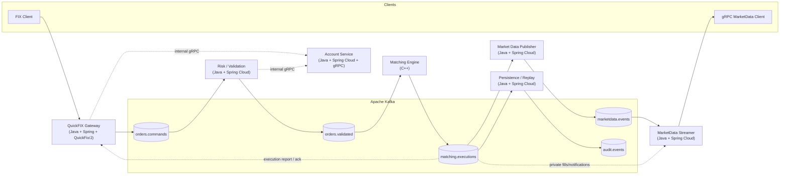

# SimpleMatch

以 **C++ 撮合核心 + Java/Spring Cloud 周邊服務** 實作的事件驅動撮合系統（microservices）。

系統採 **雙平面（two-plane）** 通訊：

- **資料面（data plane）**：以 **Apache Kafka** 作為服務間資料匯流排，承載需要保序、可回放的命令與結果（並在關鍵段落使用 Outbox pattern）
- **控制面/查詢面（control/query plane）**：以 **gRPC** 承載同步查詢與控制互動（搭配 timeout / retry / circuit breaker）

對外提供：

- **FIX**：透過 **QuickFix/J（Java）** 建立 **FIX 4.4** session（`quickfix-gateway` 作為 Acceptor）

另支援 **gRPC**：

- **內部 gRPC**：用於 gateway 與其他服務（例如帳戶/權限、查詢）做同步互動
- **對外 gRPC streaming（行情/通知）**：由 `marketdata-streamer` 對外推送全市場行情與交易雙方私有資訊

> 補充：交易額度（limits）與部位（positions）屬於「控制面/查詢面」資料，建議由獨立的內部服務提供內部 gRPC（例如 `account-service`）給 `risk-service` 使用。
>
> 若業務要求「**掛單就要扣交易額度**」，建議用 **Reservation（預扣/鎖定）** 機制：下單通過風控時先預扣可用額度，成交後轉為實扣，撤單/到期/IOC 剩餘取消則釋放預扣。

目前架構決策：

- **`matching-engine` 保留 C++**，承擔最敏感的順序、公平性與延遲要求
- **其餘服務改為 Java + Spring Cloud**，包含 `quickfix-gateway`、`account-service`、`risk-service`、`persistence`、`marketdata-publisher`、`marketdata-streamer`、`query-service`
- 因此專案採 **polyglot monorepo**：Java 服務以 Gradle 建置，原生/低延遲服務以 CMake 建置

送單與撮合主流程仍以 Kafka 事件串接為主。

本文件描述此專案的**目標架構與落地方式**。目前 repo 可能尚未包含完整程式碼/腳手架；README 會以「建議/預期路徑」表述，便於後續逐步補齊。

---

## 目標與非目標

### 目標

- 以微服務拆分交易路徑：接單、驗證/風控、撮合、落地/回放、行情發布
- 以 Kafka 事件流串接，降低服務耦合、提升擴充性與可觀測性
- 對外以 FIX（QuickFix/J，FIX 4.4）接單，並讓 **matching-engine** 以 C++ 維持最關鍵撮合路徑的順序性與低延遲特性 (建議 **P95 < 50ms**)

---

## 架構總覽

### High-level dataflow



### 同步/非同步邊界

- 對外（FIX）：採「**進系統即回覆**」的 ack；若追求更低延遲，建議以 **WAL（順序日誌）落盤成功**作為 ack 條件；保守版則以 **DB commit 成功**作為 ack 條件（Outbox pattern）
- 業務結果（成交/拒單/撤單結果）以 **Kafka 事件**回推，再由 FIX Gateway 轉成 ExecutionReport 等回報
- 對內（服務間）：
  - **資料面（data plane）/需保序與可回放的命令與結果**：以 Kafka topic 串接，預設 **at-least-once**，各服務需具備 idempotency（去重/重放安全）。其中 **Risk → Matching** 與 **Matching → 下游（persistence/marketdata/quickfix-gateway）** 建議維持 **Outbox pattern + MQ（Kafka）** 的組合，避免「已產生結果但發布失敗」或「重啟後無法回放」
  - **控制面/查詢面（control plane / query plane）**：其餘互動改用 **gRPC（同步 unary + 非同步 streaming）**，並搭配 timeout/deadline、重試機制與斷路器，避免同步耦合造成雪崩

### 服務間通訊清單（可直接落地的邊界表）

本表把「哪些用 Kafka+Outbox、哪些用 gRPC」一次列清楚，避免設計與實作走偏。

| Link | 類型 | 目的 | 建議可靠性/策略 |
| --- | --- | --- | --- |
| `quickfix-gateway` → `risk-service`（`orders.commands`） | Kafka（data plane） | 下單/撤單命令進入風控 | **Outbox+CDC**（或 WAL → DB+Outbox）後送 Kafka；consumer 以 `(command_id)`/狀態機去重 |
| `risk-service` → `matching-engine`（`orders.validated`） | Kafka（data plane） | 風控後進撮合（需保序） | **Outbox+CDC**（建議）或輕量直寫 Kafka；matching 需冪等 |
| `matching-engine` → 下游（`matching.executions`） | Kafka（data plane） | 撮合結果（可回放/對帳/回報來源） | **Outbox+CDC**（建議）或輕量直寫 Kafka；下游以 `(order_id, exec_id)`/`(exec_id)` 去重 |
| `risk-service` ↔ `account-service` | gRPC unary（control/query） | 查詢額度/部位、建立預扣 `Reserve` | 必設 deadline；讀取可重試；寫入預設不自動重試，若要重試需 `request_id`/唯一鍵冪等 |
| `quickfix-gateway` ↔ `account-service` | gRPC unary（control/query） | **FIX session 身分 ↔ `account_id` 映射、帳戶/權限驗證（選用）** | 同上（deadline + breaker + bulkhead）；建議僅在 session 建立/定期刷新使用，避免放進每筆下單的極短 ack 路徑 |
| `marketdata-streamer` → Clients | gRPC server-streaming（external） | 對外行情/私有通知推流 | 由 server 端以事件流推送；client 端需處理重連與 cursor（若有） |

> 註：若新增 `query-service`，建議它只走 gRPC（讀 Postgres/Redis projections），不要直接讀 Kafka。
>
> 補充：交易額度/預扣（`Reserve`）這類會影響「是否允許進撮合」的寫入副作用，建議固定由 `risk-service` ↔ `account-service` 處理；`quickfix-gateway` 若要接 `account-service`，通常只做 session 層的身分/權限映射或啟動時載入必要的靜態設定。
>
> gRPC 的 timeout/重試/斷路器最低規範，見下方「其餘服務間互動：gRPC（同步/非同步）+ 重試 + 斷路器（最低規範）」章節。

### 交易所級（Ultra-Low Latency + Strict Ordering）與本架構的取捨

現實世界的「交易所撮合核心」與一般微服務（例如電商）在設計哲學上差異很大：撮合核心追求的是 **極低延遲** 與 **嚴格順序**，通常會把「會影響撮合公平性/順序」的邏輯放在**同一條 deterministic pipeline** 內（甚至同一個 process / 同一台機器 / 固定 CPU affinity）。

本 README 目前的主線（Kafka + Outbox + 微服務）偏向：

- **可恢復、可觀測、可演進**（容忍 at-least-once，透過冪等/重放保證不重複生效）
- 延遲目標以 **毫秒級（例如 P95 < 50ms）** 為定位

若你的目標改成接近「交易所級 μs～低 ms」與更強的順序/公平性要求，常見會做的調整是：

- **Client → Gateway：同步**（快速回覆「已接納」）
- **Gateway → Risk：同步且 in-memory**（風控/預扣在記憶體中完成，避免跨網路 hop；若不採極致低延遲模式，則可維持 Java service 間 gRPC / Kafka 邊界）
- **Risk → Matching：定序移交（Sequencer）**：以 per-symbol（或 per-shard）sequence number 保證嚴格順序，再進撮合 loop
- **Matching → 其他：全面非同步**：行情、落 DB、稽核、結算都不能阻塞撮合核心

本專案目前的取捨是：

- **撮合核心（`matching-engine`）保留 C++**，保留低延遲開發的空間
- **接單、查詢、風控、持久化、行情推流等其餘服務改用 Java + Spring Cloud**，優先取得較高的開發效率、治理能力與維運一致性

在這個模式下，Kafka/gRPC 通常會退到「撮合後的下游匯流排/回放管道」，而不是撮合前的關鍵路徑。

---

## 服務清單（建議拆分）

> 下表為建議的微服務拆分與責任邊界，可依你的實作範圍增減。

| Service | Runtime | 說明 | In (Kafka) | Out (Kafka) | 對外介面 |
| --- | --- | --- | --- | --- | --- |
| `quickfix-gateway` | Java + Spring + QuickFix/J | FIX session 管理，FIX ↔ domain 轉換 | - / `matching.executions` | `orders.commands` | FIX |
| `account-service` | Java + Spring Cloud | 帳戶/權限、交易額度與部位查詢；提供 **Reservation（預扣/釋放）** 與風控所需同步資料 | - | - | gRPC（internal） |
| `risk-service` | Java + Spring Cloud | 基本檢核：格式、交易時段、限價/市價規則、風控 | `orders.commands` | `orders.validated` / `audit.events` | - |
| `matching-engine` | C++ | 撮合核心：訂單簿、撮合；支援 IOC（立即成交否則取消剩餘量）；產出成交/拒單/撤單結果 | `orders.validated` | `matching.executions` / `audit.events` | - |
| `persistence` | Java + Spring Cloud | 落地事件流、建立索引、支援重放（replay） | `matching.executions` | `audit.events` | - |
| `marketdata-publisher` | Java + Spring Cloud | 將撮合產出轉成行情事件（trade/quote） | `matching.executions` | `marketdata.events` | - |
| `marketdata-streamer` | Java + Spring Cloud | 對外 gRPC streaming：推送全市場行情 + 私有成交/通知 | `marketdata.events` / `matching.executions` | - | gRPC (stream) |
| `query-service` | Java + Spring Cloud（選用） | 對內查詢 API，讀取 Postgres/Redis projections | - | - | gRPC / HTTP（internal） |

> 若需要提供內部查詢 API，可新增 `query-service`（對外只開內網），由它讀取 Postgres/Redis 提供 gRPC/HTTP 查詢。

---

## CQRS（Command Query Responsibility Segregation）對齊狀態

本架構 **具備 CQRS 的核心元素**：將「寫入（commands/events）」與「查詢（read model）」分離，並用事件去更新查詢投影；但它屬於**輕量 CQRS**（不是每個 domain 都嚴格拆成獨立資料庫/獨立模型）。

- **Command / Write path（寫入側）**：
  - 對外下單/撤單透過 `quickfix-gateway` 進入系統，寫 DB + outbox 後發出 `orders.commands`。
  - `risk-service`、`matching-engine` 依序消費/產生事件，最終輸出 `matching.executions`。
  - 重要副作用（例如額度預扣/釋放/成交轉實扣）由 `account-service` 以 reservation 形式維持一致性（內部 gRPC 或事件驅動更新）。

- **Query / Read path（查詢側）**：
  - `persistence`（以及未來可選的 `query-service`）把事件流投影（projection）到 Postgres/Redis，提供低延遲查詢。
  - `marketdata-streamer` 從事件流形成對外行情/通知視角，也是另一種 read model。

關鍵觀念：

- 查詢側資料（Postgres/Redis 的查詢表/快取）可以視為 **projections**：可重建、允許最終一致。
- 寫入側以狀態機/冪等保證「重複訊息不重複生效」，而查詢側則以投影更新提供可讀性與效能。

## Kafka 訊息契約（Contract）

本章節把服務間的「事件契約」寫清楚，讓你能在微服務拆分下仍維持可預期的一致性（尤其是撮合保序與冪等）。

## 架構對齊評估：Event Driven 與 Event Sourcing

### Event Driven（事件驅動）

目前架構 **符合 Event Driven**：

- 交易主流程以 Kafka topic 串接（`orders.commands` → `orders.validated` → `matching.executions`）。
- 以 Choreography Saga 讓各服務「消費事件 → 決定下一步 → 發出事件」，避免同步耦合。
- 設計假設 at-least-once，並要求 consumer 冪等與可重放，符合事件驅動系統常見的故障模型。

### Event Sourcing（事件溯源）

目前架構 **部分符合 Event Sourcing 的精神，但還不是嚴格的 Event Sourcing**。

符合的部分：

- `matching.executions` 與 `marketdata.events` 本身就是 append-only 的事件流，`persistence` 也在做「從事件建立查詢投影（projections）」的工作。
- Outbox + CDC 讓「事件發布」與「本地交易 commit」綁在一起，有利於可追溯與故障恢復。

尚未完全符合（與典型 Event Sourcing 差異點）：

- Event Sourcing 強調「**事件是系統的權威來源（source of truth）**，狀態是從事件重建而來」。目前設計仍以多張業務表（例如 `orders`、`executions`、以及 `account-service` 的額度/預扣狀態）作為主要權威狀態，事件更多是用於服務間整合與下游投影。
- Outbox/CDC 解決的是可靠發布（delivery），但它寫入的是「要送出去的 integration event」，不等同於「完整且可重建 domain event store」。

若你希望收斂成更標準的 Event Sourcing（建議最小補齊項）：

- 明確定義每個 aggregate 的事件流（例如 `Order` / `Reservation`），並確保事件具備 `aggregate_id`、`sequence`（或 version）、`event_type`、`event_time`、`schema_version`。
- 落一個真正的 append-only `event_store`（可在 PostgreSQL，用 `(aggregate_id, sequence)` 唯一；或用 Kafka 搭配 compaction/外部儲存，但需明確重建策略）。
- 所有狀態表（`orders`、查詢 Redis、額度/部位投影）都視為 projections：可由事件重播重建，且允許丟掉重建。
- 快照（snapshot）策略：針對長 event stream（例如高頻撮合/部位變更）定期做 snapshot，加速重建。

### 補充：把架構調整到「完全 Event Sourcing」的好處

以你目前的設計（Kafka 事件主幹 + Outbox/CDC + 投影到 Postgres/Redis）來說，已經能拿到事件驅動系統的多數好處；如果再往「完全 Event Sourcing」收斂，常見額外收益會是：

- **可重建性更強**：任何投影表/快取壞掉，可以直接從 event store 重播重建（不必靠備份或手動修資料）。
- **可稽核/可追溯**：事件序列天然形成完整審計軌跡，能回答「為什麼變成這個狀態」（who/when/why）。
- **時間旅行查詢**：理論上可重建任意時間點的狀態（例如盤中某秒的可用額度/委託狀態），對事故追查很有用。
- **讀模型可多樣化**：同一套事件可投影成多種查詢模型（例如風控視角、客戶視角、營運視角），互不影響寫入模型。

但代價也很現實（特別是交易系統）：

- **事件設計/版本控更難**：事件一旦寫入就是長期契約；schema 演進、backfill、相容性都要規範化。
- **重播成本**：需要考慮 event store 的保留策略、重播效率、快照頻率、以及投影重建時間。
- **跨 aggregate 一致性要更小心**：事件驅動下仍是「每個 aggregate 本地一致」，跨域不變量通常要靠流程/補償維持。

### 什麼是 Projection（投影）？（白話）

Projection 可以把它理解成：

- **「從事件算出來的查詢結果表」**。

在 Event Sourcing 裡，權威資料是事件（event stream）。但事件不適合直接拿來做所有查詢（太慢、要掃很多事件），所以會有一個或多個 consumer 把事件「算」成好查的資料結構（例如一張 `orders` 表、或 Redis 的 `order:{order_id}`）。

因此：

- 事件（event store）是 source of truth。
- `orders`/`executions`/Redis 這些用來查詢的表或快取是 projections（可以丟掉重建）。

你目前的架構其實已經在做 projection：`persistence` 消費 `matching.executions`，批次落地成 `executions` 與更新 `orders` 查詢狀態，這就是一種投影。

### 「哪個 aggregate 要以事件為權威」是什麼意思？

先把兩個名詞拆開：

- **Aggregate（聚合）**：DDD 裡的一個一致性邊界，你可以把它理解成「需要一起維持不變量的一坨狀態 + 行為」。例如：
  - `Order`（訂單）是一個 aggregate：它的狀態轉移（PENDING→MATCHING→FILLED/CANCELLED…）必須自洽。
  - `Reservation`（預扣額度）也可以是一個 aggregate：它需要保證 `reserved = filled + remaining` 等不變量，且能處理 Release/ApplyFill 的冪等。
- **以事件為權威（event-authoritative）**：意思是「這個 aggregate 的最終真相到底存在哪裡？」
  - 若你選 **事件為權威**：真相在 event store（事件流）；目前狀態只是從事件重建出來的。
  - 若你選 **狀態表為權威**：真相在資料表（例如 `orders` 表、`account_reservations` 表）；事件只是對外通知或整合用。

套回你的例子：

- **Order 以事件為權威**：
  - 你會有 `OrderPlaced`、`OrderRejected`、`OrderValidated`、`OrderCancelled`、`OrderPartiallyFilled`、`OrderFilled` 這類 domain events。
  - `orders` 表只是把事件投影成「目前狀態」的快照，用來查詢。
- **Reservation 以事件為權威**：
  - 你會有 `ReservationCreated`、`ReservationReleased`、`ReservationFillApplied`（或類似）事件。
  - `account_reservations` 與可用額度欄位（available/reserved）則是投影。

在「不想一次把整個系統變成完整 Event Sourcing」的前提下，一個常見且務實的選擇是：

- 撮合主路徑仍以 Kafka 事件驅動與冪等為主。
- **先讓 `Reservation` 這種需要可追溯/可對帳的邏輯，走事件為權威**（因為你已經有預扣/釋放/成交轉實扣的需求，事件序列能清楚解釋每一次變化）。
- `Order` 則可先維持「狀態表為權威 + 事件通知」，等流程穩定後再評估是否值得全面事件溯源。

## 可靠性與一致性（交易不漏單、不重複「生效」）

交易系統要避免的核心問題通常分兩類：

1. **漏單（lost）**：用戶已成功送出，但系統未進入後續處理
2. **重複單（duplicate）**：同一筆請求被處理兩次，造成雙重成交/雙重扣帳等「重複生效」

### 重要觀念：很難做到「絕對不重複訊息」，但可以做到「重複不會重複生效」

- Kafka/CDC 都可能在故障切換、重試、replay 時產生重複訊息
- 正確做法是讓每個 consumer 都具備 **idempotency（冪等）**，以 `order_id` / `event_id` / 狀態機版本控制，確保重複處理不會造成重複副作用

### Outbox Pattern + Debezium CDC（你描述的方向）

當你擔心「broker 掛掉或 producer publish 失敗，導致漏單」時，Outbox + CDC 是很常見且務實的做法：

- 每個會對外發事件的服務，在自己的 **PostgreSQL** 交易中同時寫入：
  - 業務資料（例如：收到的委託、風控結果、成交回報）
  - `outbox` 表（一列代表一則待發布事件，包含 topic、key、payload、event_id、created_at）
- Debezium 監聽 `outbox` 表的變更，把事件推到 Kafka

這可以把「是否成功寫 Kafka」的風險，轉成「是否成功 commit 到本地 DB」的風險（通常更好控、也更符合交易系統保守的設計）。

### Kafka 高可用：Leader 切換時間與副本一致性

你問的「leader 掛了多久會選出新 leader」與「replicas 是否一致」是對的擔憂。

#### Leader 重新選舉通常多久？

- Kafka 的 leader failover 通常是「**秒級**」：常見落在約 1～10 秒的區間（視 broker 故障偵測、controller 狀態、網路與負載而定）。
- 在 failover 期間，producer/consumer 可能會收到 `NOT_LEADER_OR_FOLLOWER` / timeout，正常做法是 client 端重試並更新 metadata。

> 這不是切到「其他 partition」，而是同一個 partition 在 ISR 裡換一個 leader。

#### 怎麼確保 replicas 跟 leader 一致？

你想要避免的是「訊息寫入被回覆成功，但之後因為不乾淨選主或資料未同步而消失」。建議的基本原則：

- topic 設定 `replication.factor = 3`
- broker/topic 設定 `min.insync.replicas = 2`
- producer 設定 `acks = all`（並搭配合理的重試/超時）
- **停用 unclean leader election**（避免選到落後副本當 leader，造成已確認寫入的資料遺失）

上述組合的語意是：只有當至少 2 份副本確認寫入，producer 才會得到成功回覆；即使壞一台 broker，也能在 ISR 內安全選主。

#### Debezium 會知道 DB 跟 Kafka 不一致嗎？

- Debezium 的角色是「**把 DB 的變更（outbox insert）發到 Kafka**」，它不會主動比對「Kafka topic 是否少了一段資料」來幫你補洞。
- 若 Kafka 暫時不可寫（broker down / leader 切換中），Debezium（Kafka Connect）通常會 retry，等 Kafka 恢復後再繼續送；DB 端 outbox 資料仍在，因此不會漏單。
- 若你允許不安全的 Kafka 設定（例如 unclean leader election），可能出現「Kafka 曾經接受/回覆成功但後來資料遺失」的極端情況；這種情況 Debezium **不保證能自動偵測並修復**，所以應該用上面的 ISR/acks 設定去避免它。

總結：Outbox+Debezium 解決「不漏單」很有效，但仍需 Kafka 自身用 ISR/acks/禁用 unclean election 來避免「已確認寫入卻遺失」的風險。

### 建議的「進系統即回覆」ACK 條件（WAL 版，延遲更低 P95 << 50ms）

你希望 FIX 收到就回覆（進系統即可），同時又不希望「回了 ACK 但其實漏單」。若你想把 ACK 往前推、降低被 DB tail latency 影響，建議把「可靠錨點」從 DB commit 改為 **WAL（順序日誌）落盤成功**。

建議路徑：

1. FIX Gateway 完成基本格式檢查（必要欄位、session 狀態）
2. 以 append-only 方式寫入 **WAL**（建議包含：FIX session 身分、`MsgSeqNum`、`ClOrdID`、原始 FIX 或等價的 canonical 表示、internal `order_id`、`received_at`）
3. **WAL 落盤成功後**立刻回 FIX ack（例如 `ExecutionReport` 表示已接受/委託中）
4. 由背景執行緒/獨立 ingester 從 WAL 讀取，異步寫入 PostgreSQL（`orders`）並同 transaction 寫入 `outbox`（待發到 `orders.commands`）
5. Debezium CDC 把 outbox 事件推到 Kafka，後續照既有 `orders.commands` → `risk-service` → `orders.validated` → `matching-engine`

#### 「比較像交易所」的回覆語意：兩階段（Accepted vs Live）

交易所常見會把「回覆」拆成兩個層級的承諾，避免 client 誤以為“已回覆 = 一定會成交/一定已進簿”。對應到本設計：

- **階段 1：Accepted / Received（不漏單承諾）**
  - 回覆時點：**WAL 落盤成功**（或保守版的 DB commit + outbox）
  - FIX 回報建議：送一筆 `ExecutionReport` 表示 *PendingNew/委託中*（語意是「我已可靠接納、之後一定會給你最終結果」）
- **階段 2：Live / New（已通過檢核、已進撮合佇列或委託簿）**
  - 回覆時點：`risk-service` 檢核通過，且命令已被 `matching-engine` 接管（或狀態進到 `MATCHING`）
  - FIX 回報建議：再送一筆 `ExecutionReport` 表示 *New/已進簿*（語意是「此單已具備撮合資格」）

若風控失敗，則以 `ExecutionReport` 的 *Rejected*（或對應拒單訊息）作為最終結果；重送時以 `ClOrdID` 去重，確保同一命令不會重複生效。

注意事項（WAL 版的關鍵）：

- **WAL 必須可回放**：FIX Gateway 重啟時必須能從 WAL 恢復「哪些已回 ACK 但尚未進 outbox」的請求，確保最終一定會被發到 Kafka。
- **WAL 落盤策略（group commit）**：可用批次 flush（例如每 X μs 或每 N 筆）在延遲與 durability 間取捨；若要強保證，則每筆都需要確保落盤語意。
- **HA/容災**：若你要把「已回 ACK」視為強承諾，WAL 需配合磁碟可靠度與（可選）同步複寫到備援節點，否則單機磁碟故障仍可能造成遺失。

#### 保守版（DB commit 後回 ACK）

若你優先追求「最容易證明不漏單」，可以維持原本做法：

- FIX Gateway 完成基本格式檢查後，將請求寫入 PostgreSQL（`orders`/`commands`）
- 同一個 transaction 寫入 `outbox`（待發到 `orders.commands`）
- **transaction commit 成功後**回 FIX ack

為了把延遲壓在 50ms 內，FIX Gateway 的同步路徑建議只做：

- FIX session 驗證、必要欄位驗證、基本防呆（例如價格/數量格式）
- DB 單筆交易寫入（小交易、索引齊全）

風控與撮合的結果不要卡在 ack 路徑上。

### 訂單狀態機（建議）

你提到的「委託中 → 撮合中」想法是合理的：它讓使用者看到狀態逐步推進，也能把 risk/matching 的處理延遲可視化。

建議以事件驅動的狀態機表達（示意）：

- `RECEIVED`：FIX Gateway 已接收（尚未 commit DB 前的暫態，可不落地）
- `PENDING`（委託中）：寫 DB + outbox commit 成功並回 ACK 後
- `RISK_CHECKING`（風控中）：risk-service 已開始處理（可選，視你是否要呈現）
- `MATCHING`（撮合中）：已通過風控，等待撮合/已進撮合佇列
- `DONE`：終態（`FILLED` / `PARTIALLY_FILLED` + `CANCELLED` / `REJECTED` / `EXPIRED`）

效益：

- ACK 很快回（只需 DB commit）
- 狀態透明：risk 卡住 vs 撮合卡住可區分
- Saga 事件更清楚：每一步狀態由哪個服務負責推進可追蹤

### Risk → Kafka → Matching 該怎麼做？（建議兩種等級）

#### A. 強一致保守版（建議交易系統採用）

- `risk-service` 消費 `orders.commands` 後，不直接 publish，而是：
  1) 以 DB transaction 寫入 `risk_decision`（或更新 order 狀態）
  2) 同 transaction 寫入 `outbox`（要發到 `orders.validated` 或 `audit.events`）
  3) Debezium 發到 Kafka

風控檢核若需要「同步讀取」交易額度/部位，建議：

- 由 `risk-service` 透過內部 gRPC 查詢 `account-service`（limits/positions）。
- 為了符合 P95 < 50ms，`risk-service` 應以快取/快照為主（例如啟動載入、定期刷新、或由事件更新投影），避免每筆委託都做多次遠端查詢。

若業務要求「掛單就要扣交易額度」，建議把風控的同步互動從單純 `GetLimits/GetPositions` 擴展為：

- `Reserve(order_id, account_id, symbol, side, qty, price, tif, ...)`：通過風控時建立 reservation（預扣）。
- `Release/ApplyFill`：建議採「事件驅動」（方案 A）：由 `account-service` 消費撮合結果事件（例如 `matching.executions` 內的成交/取消結果）來釋放預扣或把預扣轉為實扣/更新部位。

為了避免 gRPC 重試造成重複扣額度，`Reserve` 需具備冪等性（例如以 `order_id` 做唯一鍵）；事件驅動的 `ApplyFill/Release` 則以 `exec_id`（或結果事件 id）去重。

#### 台股市價單：建議的「預扣」與保護價定義（MVP 可落地）

市價單若要做到「掛單即預扣」且可對帳，建議在進入 `Reserve` 前先把它轉成可計價的形式：

- **內部統一用限價委託表示**：對外收到 `order_type = MARKET` 時，在 `quickfix-gateway` 或 `risk-service` 先計算 `protection_limit_px`，並把它當作內部的 `price`（同時保留 `original_order_type = MARKET` 供稽核）。
- **保護價（protection limit）建議取台股「當日漲跌停價」**：
  - 買單：`protection_limit_px = 當日漲停價`
  - 賣單：`protection_limit_px = 當日跌停價`
  - 並依商品跳動單位（tick size）做合法化/四捨五入（通常買單向上取整、賣單向下取整）。
- **預扣金額（買單）用最保守估算**：`reserved_amount = qty * protection_limit_px * (1 + fee_buffer)`
  - `fee_buffer` 用來涵蓋手續費/雜項（以參數化方式設定，避免寫死）。
- **預扣數量（賣單）通常只需預扣股數**：`reserved_qty = qty`（賣出交易稅通常影響的是淨入帳，不需事先預扣現金）。

若你不希望市價單在委託簿「留倉」造成語意爭議，建議營運規則上優先使用 `MARKET + IOC/FOK`；`MARKET + ROD` 則明確定義為「等同於帶保護價的限價 ROD」。

搭配 consumer 端的冪等處理（見下），可以做到：

- broker 掛掉：不會漏（因為事件在 DB outbox）
- 事件重放：不會重複生效（因為 matching 會去重/檢查狀態機）

#### B. 輕量版（延遲更低、依賴 Kafka 設定）

- `risk-service` 直接用 Kafka producer 發 `orders.validated`
- producer 設定建議：`acks=all`、啟用 idempotent producer、合理的重試與超時
- matching 仍需做冪等（不然重複訊息仍可能造成重複生效）

若你最在意「萬無一失」，通常會偏向 A。

### Matching → Kafka → 下游（persistence/marketdata/quickfix-gateway）該怎麼做？

撮合結果（`matching.executions`）通常被視為系統最重要的事件流之一：它既是對外回報的來源，也是對帳/重放的依據。若你希望它在故障下「不漏、不亂序、可回放」，建議比照 `risk-service` 採用 Outbox pattern。

#### A. 保守版：Outbox + CDC（建議）

- `matching-engine` 對同一個 `symbol` 的撮合 loop 產出結果後，不直接 publish，而是：
  1) 以「本地落地」方式寫入結果（可為 `executions`/`order_state` 或 append-only 的 `matching_journal`）
  2) 同 transaction 寫入 `outbox`（要發到 `matching.executions` 與/或 `audit.events`）
  3) Debezium CDC 發到 Kafka

注意：這會把 DB I/O 帶入撮合後半段路徑。若你追求更極致的撮合延遲，應把「落地」拆出來（例如 matching 只寫本地 WAL/journal，後台 ingester 再落 DB + outbox），但語意上仍維持「先有可回放的 durability 錨點，再對外/對下游發布」。

#### B. 輕量版：Matching 直寫 Kafka（延遲更低、依賴 Kafka 設定）

- `matching-engine` 直接用 Kafka producer 發 `matching.executions`
- producer 設定建議：`acks=all`、啟用 idempotent producer、合理的重試與超時
- 下游（`persistence`/`quickfix-gateway`）仍需做冪等（`exec_id` 唯一鍵 / processed table）

若你最在意「撮合結果萬無一失可回放」，通常會偏向 A。

### 其餘服務間互動：gRPC（同步/非同步）+ 重試 + 斷路器（最低規範）

當你把「非關鍵路徑」改用 gRPC（例如 `risk-service` 查 `account-service`、或內部查詢/控制 API），務必先把故障模型寫清楚，否則很容易因為重試/timeout 造成重複副作用或雪崩。

- **Deadline 必須強制**：所有 outbound RPC 必須設定 deadline（例如 5–50ms 級別，依路徑而定），不可無限等待
- **Retry 只對安全方法自動啟用**：
  - 讀取/查詢（`Get*`）可自動重試（針對 `UNAVAILABLE`/`DEADLINE_EXCEEDED` 等暫態錯誤），並使用指數退避（exponential backoff）+ jitter
  - 會產生副作用的寫入（`Reserve`/`Create*`/`Update*`）預設**不可**自動重試；若業務需要重試，必須在 API 層明確帶 `request_id`（或用 `order_id`）並在服務端做去重（以唯一鍵保證「重送不重複生效」）
- **Circuit Breaker（斷路器）**：針對依賴服務（例如 `account-service`）在連續失敗時快速打開 breaker，短時間內直接 fail-fast，避免同步等待拖垮上游；breaker 半開（half-open）時小流量探測恢復
- **Bulkhead（隔離）**：把不同下游依賴的連線池/執行緒池隔離，避免某個依賴卡住拖垮整個服務
- **Fail-open vs Fail-closed 要明確**：風控相關預設應 fail-closed（依賴不可用則拒單/拒絕預扣），行情/查詢可視需求 fail-open（回快取/降級資料）

#### gRPC 落地細節（建議值/可執行規範）

- **Deadline 建議值（起步）**：
  - 同機房/同叢集內查詢（`Get*`）：10–30ms
  - 預扣寫入（`Reserve`）：20–50ms（視 DB/鎖競爭而定）
  - 背景性控制（非交易路徑）：100–500ms

- **可重試錯誤（僅限安全讀取）**：
  - 建議只針對暫態錯誤：`UNAVAILABLE`、`DEADLINE_EXCEEDED`、`RESOURCE_EXHAUSTED`
  - 每次重試都必須帶 jitter，避免同步重試放大尖峰
  - 重試上限應小（例如 1–2 次），並以 deadline 做總時間上限（不要“重試到超時”）

- **Kubernetes 下的 service discovery + gRPC client 行為**：
  - 在 K8s 內預設用 Service DNS（例如 `account-service.default.svc.cluster.local`）
  - 注意 gRPC client 通常會長連線；滾動更新或 endpoint 變更時，需搭配：
    - 合理的連線重建策略（例如定期 re-resolve DNS 或在連線失敗時快速重連）
    - `readinessProbe`（只把 ready 的 pod 放進 endpoints）
  - 若你需要 client 端更平均的負載分散，可評估 client-side LB（例如 round-robin over endpoints）；但這屬於進階項，side project 可先用預設行為

- **Keepalive 與連線池**：
  - 對控制面 RPC：建議維持少量長連線（connection reuse），避免每筆都重建 TCP/TLS
  - 設定合理 keepalive，避免 NAT/idle timeout 造成“看似連著其實已斷”的長尾 timeout

- **冪等（寫入型）落地規範**：
  - 若 `Reserve` 必須允許 client 重送：request 需帶 `request_id`（或使用 `order_id`）
  - 服務端以唯一鍵保證：同 `request_id` 只能生效一次，重送回同結果

### Consumer 冪等（適用所有服務）

建議每個 consumer 具備至少一種冪等策略：

- **Inbox/Processed table**：在 DB 記錄已處理 `event_id`，重複則跳過
- **狀態機檢查**：同一 `order_id` 的狀態轉移必須符合狀態機（不符合即拒絕/忽略）
- **唯一鍵約束**：例如 `(order_id, exec_id)` 唯一，防止重複插入成交

### Choreography Saga（落地方式）

本專案採 Choreography：每個服務根據收到的事件決定下一步並發出新事件。

以送單為例（示意事件鏈）：

1. FIX Gateway：DB commit + outbox → Debezium → `orders.commands`
2. risk-service：決策落 DB + outbox → Debezium → `orders.validated`（或 `orders.rejected`）
3. matching-engine：撮合結果落地 + outbox → Debezium → `matching.executions`（或輕量版直接 publish）
4. persistence：批次落地成交/狀態（batch commit）並更新查詢投影
5. FIX Gateway：消費 `matching.executions`，轉為 FIX 回報

#### 回滾/補償（Compensation）怎麼做？

Choreography Saga 一般**不做分散式交易回滾**（不會像同一個 DB transaction 那樣一鍵 rollback），而是用「**補償事件（compensating events）** + 狀態機」把系統拉回到一致且可解釋的狀態。

- **新增單（New）**：FIX Gateway 回 ACK 後，若 `risk-service` 判定不通過，發出 `OrderRejected`（或 `orders.rejected` 類型事件）並把該筆訂單狀態推進到終態 `REJECTED`；後續服務收到後應忽略/停止處理。
- **撤單（Cancel）**：撤單本身就是一種補償命令；若訂單已部分成交，撤單只會「停止剩餘量」並產生對應的撤單結果事件（例如 leaves=0/剩餘量歸零），不會撤回已成交的 execution。
- **不可回滾邊界**：一旦 `matching-engine` 產生成交（`matching.executions`），成交在交易語意上通常視為不可逆；若業務需要撤銷成交，會是「更正/沖銷（bust/correction）」的獨立流程與事件類型（建議先列為 MVP 以後再做）。
- **失敗後恢復**：本設計的重點是「可重放、可去重」而不是回滾。下游（例如 `persistence`）寫 DB 失敗時，不回滾撮合結果，而是透過重試/重放 `matching.executions`，配合唯一鍵與 `processed_events` 達到最終一致。

---

### Topic 命名慣例（建議）

- 使用 `{domain}.{type}` 形式：
  - `orders.commands`：送單/撤單 command
  - `orders.validated`：通過檢核後可進撮合的 command
  - `matching.executions`：撮合結果事件（成交、部分成交、拒單、撤單結果…）
  - `marketdata.events`：行情事件（trade/quote…）
  - `audit.events`：審計/追蹤事件（可選）

  ### Topic 一覽（建議規格）

  > 下表是可直接落地的 topic catalog：包含 partition key、produced/consumed 關係，以及冪等策略。

  | Topic | Key / Partition | Payload（Protobuf） | Produced by | Consumed by | 冪等 / 去重建議 |
  | --- | --- | --- | --- | --- | --- |
  | `orders.commands` | **按股票路由**（見下），同一 `symbol` 必須保序 | `OrderCommand` | `quickfix-gateway`（Outbox+CDC） | `risk-service` | 以 `(command_id)` 或 `(order_id, command_seq)` 去重；狀態機檢查 |
  | `orders.validated` | **按股票路由**（與 commands 同一套路由） | `OrderValidated` / `OrderRejected` | `risk-service`（Outbox+CDC） | `matching-engine` | matching 以 `(command_id)` 或 `(order_id, command_seq)` 去重；非法狀態轉移直接忽略 |
  | `matching.executions` | key = `symbol`（保序） | `ExecutionEvent` | `matching-engine`（建議 Outbox+CDC；或輕量版直接 publish） | `persistence`, `marketdata-publisher`, `quickfix-gateway` | `persistence` 以 `(order_id, exec_id)` 唯一鍵；`quickfix-gateway` 以 `(exec_id)` 去重 |
  | `marketdata.events` | key = `symbol` | `MarketDataEvent` | `marketdata-publisher` | `marketdata-streamer`（對外推流）, （其他下游） | 允許重複（可用 `(event_id)` 去重或以時間窗合併） |
  | `audit.events` | key = `symbol` 或 `order_id`（視查詢方式） | `AuditEvent` | 各服務 | （稽核/資料平台） | 允許重複；如需強一致稽核可用 `(event_id)` 唯一 |

  ### 行情與私有資訊：對外推流方式（gRPC streaming）

  Kafka topic（例如 `marketdata.events`）定位是「內部匯流排」，通常不會直接暴露到外網。

  本專案建議用 `marketdata-streamer` 做對外發布：

  - **全市場行情**：`marketdata-streamer` 消費 `marketdata.events`，以 gRPC server-streaming 推送（可按 symbol 訂閱）
  - **交易雙方私有資訊**：`marketdata-streamer` 也可消費 `matching.executions`，把成交/回報依 `account_id` 做授權後推送給該帳戶

  > 若未來私有事件量很大，可再把私有通知獨立成專用 topic（例如 `trade.notifications`），由撮合或 persistence 產生，避免 `marketdata-streamer` 在 `matching.executions` 上做過多過濾。

  #### gRPC API 草案（可直接開工的介面形狀）

  以下為 `marketdata-streamer` 對外提供的 gRPC streaming 介面草案（示意）：

  ```proto
  syntax = "proto3";

  package simplematch.marketdata.v1;

  service MarketDataService {
    // 全市場行情：依 symbol 訂閱 trade/quote 等事件
    rpc SubscribeMarketData(SubscribeMarketDataRequest) returns (stream MarketDataEvent);

    // 私有通知：只推送該帳戶可看的成交/委託回報等事件
    rpc SubscribePrivateNotifications(SubscribePrivateNotificationsRequest)
        returns (stream PrivateNotification);
  }

  message SubscribeMarketDataRequest {
    repeated string symbols = 1; // 空代表全市場（需權限控管或限制）
  }

  message SubscribePrivateNotificationsRequest {
    string account_id = 1; // 或由 token / mTLS identity 映射，不允許 client 任意填
  }

  message MarketDataEvent {
    string event_id = 1;
    string symbol = 2;
    int64 ts_unix_ms = 3;
    oneof payload {
      Trade trade = 10;
      Quote quote = 11;
    }
  }

  message Trade {
    double price = 1;
    int64 qty = 2;
  }

  message Quote {
    double bid_px = 1;
    int64 bid_qty = 2;
    double ask_px = 3;
    int64 ask_qty = 4;
  }

  message PrivateNotification {
    string event_id = 1;
    string account_id = 2;
    string order_id = 3;
    int64 ts_unix_ms = 4;
    oneof payload {
      Execution execution = 10;
      OrderStatusUpdate order_status = 11;
    }
  }

  message Execution {
    string exec_id = 1;
    string symbol = 2;
    double price = 3;
    int64 qty = 4;
  }

  message OrderStatusUpdate {
    string status = 1;
    int64 leaves_qty = 2;
  }
  ```

  #### 認證/授權（建議）

  - **傳輸加密**：對外 gRPC 建議強制 TLS。
  - **身分認證**：建議優先使用 **mTLS**（用 client certificate 綁定帳戶/租戶），或使用 JWT/OAuth2。
  - **授權**：
    - `SubscribeMarketData`：依訂閱 symbol 做 ACL（例如哪些 symbol 可看、是否允許全市場）。
    - `SubscribePrivateNotifications`：`account_id` 建議由憑證/Token 映射而來，避免 client 任意指定。
  - **隔離與流控**：針對每個連線做 rate limit/backpressure，避免單一 client 拉爆推流服務。

  ### Partition / Sharding 策略（以股票為單位，支援熱點調整）

  你提出的策略很務實：

  - 市場約 1500 檔股票
  - 預設「每 100 檔股票一個 shard」→ 約 15 個 shard
  - 允許特定股票交易量飆升時，將該股票單獨對應到**獨立 Kafka partition**（甚至獨立撮合實例）

  #### 為什麼建議用 `symbol` 而不是 `account_id`？

  撮合本質上需要「同一商品的訂單必須在同一條序列上處理」，不然會出現跨分區撮合一致性問題：

  - 若用 `account_id` 分區：同一檔股票的買賣單會散落多個 partition，撮合引擎要跨分區合併 order book，等於回到分散式鎖/共識的難題
  - 用 `symbol`（或 symbol 路由）分區：同一檔股票的命令與撮合事件天然保序，撮合引擎可以「單執行緒/單實例」處理該 symbol 的 order book

  #### 具體落地：用「路由表」控制 symbol → partition

  Kafka 的「key」通常用 hash 決定 partition；要做到「某一檔股票固定去指定 partition」，建議採其中一種做法：

  1. **Producer 明確指定 partition（推薦）**
      - 維護一份 `symbol_routing`（symbol → partition_id）
      - `quickfix-gateway`、`risk-service` 發事件時直接指定 partition
  1. **用可調整的 routing key（折衷）**
      - key 不直接用 symbol，而是 `routing_key`（例如 `shard-03`、`symbol-2330`）
      - 透過改變 routing_key 讓特定 symbol 落到不同 hash bucket

  不論哪種方式，關鍵是：

  - `orders.commands` 與 `orders.validated` 必須用**同一套路由規則**，確保同一 symbol 的命令序列一致
  - `matching.executions` 至少要以 `symbol` 保序（通常 key = symbol 即可）

  #### 路由表更新的注意事項（重要）

  你這裡的需求是「**觀察到某檔成交量偏高後，在隔日開盤前手動調整**」，這比執行時期動態遷移簡單許多，也更安全。

  建議把 `symbol_routing` 做成「可版本化/可生效日」的設定，並在每日開盤前固定載入一份快照：

  - `symbol_routing` 增加 `effective_trading_day`（或 `effective_from`）欄位
  - 每個 producer/consumer（`quickfix-gateway`、`risk-service`、`matching-engine`）在服務啟動或開盤前載入「當日 routing snapshot」
  - 交易時段內 **不變更 routing**（避免同一交易日內破壞保序）

  盤前手動調整流程（建議）：

  1. 依前一日統計（symbol 吞吐、lag、撮合耗時）決定要獨立分區的 hot symbols
  1. 更新 `symbol_routing` 的 `effective_trading_day = next_day`
  1. 開盤前重新部署/重啟相關服務，確保載入相同 snapshot

  這樣做的效果是：

  - 不需要在交易中停單或等待水位
  - 不需要搬移既有訊息；因為新交易日從新的 routing 開始生效
  - 同一交易日內同一 `symbol` 的命令仍能保序

  #### 固定 partition → `matching-engine-N`（避免 rebalance 換人）

  你希望做到「partition 0 永遠由 match service 0 處理，且主掛了由備接手，但不要因為 consumer group rebalance 改變固定關係」。這在交易撮合場景很常見，建議做法是：

  - **不要使用 `subscribe()` 的 consumer group 自動分配**：自動分配的設計目標就是讓 partition 會在 group 成員間搬移（rebalance），這與「固定綁定」相衝突
  - **改用 StatefulSet + 手動 `assign()` 綁定 partition**：
    - 以 Kubernetes `StatefulSet` 部署 `matching-engine`，讓 instance 身分固定為 `matching-engine-0/1/2/...`
    - `matching-engine-0` 啟動後只 `assign()` `orders.validated` 的 partition 0（以及它負責的其他 partitions，若有）
    - `matching-engine-1` 只負責 partition 1，以此類推
    - 這種模式下不走 consumer group balance，因此**不會發生 rebalance 造成 partition 換人**

  #### 主備接手（Active-Standby）與 fencing（避免雙主）

  > 名詞釐清：Kafka 的 ISR（in-sync replicas）是 **broker/topic 的副本機制**，不是 service 的副本機制。你要的是「服務層主備」。

  若你希望 `matching-engine-0` 出問題時由備援快速接手，但仍維持「partition 0 ↔ shard-0」這種固定關係，建議：

  - **同 shard 一主一備**：例如 `matching-engine-0`（主）+ `matching-engine-0-standby`（備）
  - **備援持續追上狀態**（warm standby）：備援可以用另一個 consumer group 跟讀同樣的事件流，用來重建 order book/狀態，但在未接管前不得對外產生成交結果
  - **fencing（硬性仲裁）**：用 etcd/Consul/ZooKeeper/Postgres advisory lock 等做「每個 shard/partition 一把鎖」
    - 只有拿到鎖的 instance 才允許產出 `matching.executions`（或寫入 matching outbox/journal）
    - 接手流程必須先取得鎖，再開始對外產出結果，避免雙主同時撮合同一 partition
  - **offset 對齊**：備援接管前需先對齊主的最後處理進度（例如讀取主群組的 committed offset，`seek()` 從該點開始），避免漏單或大量重播造成延遲尖峰

  以上做法把「固定綁定」與「主備切換」從 Kafka rebalance 解耦：rebalance 是 consumer group 的機制；而交易撮合 shard owner 的切換，應由你自己的仲裁/fencing 規則決定。

### Partition key 原則（建議）

選 key 的核心是「**需要保持順序的維度**」：

- 若要保證同一 `orderId` 的狀態變化順序：key = `orderId`
- 若撮合引擎以 `symbol`/`instrument` 做單一撮合分片：key = `symbol`
- 若風控/額度以 `accountId` 維度一致性為主：key = `accountId`

實務上常見做法：

- `orders.commands` / `orders.validated`：**按股票路由**（本專案以 `symbol` 為核心）
- `matching.executions`：key = `symbol`（保序）

### Delivery semantics 與去重

Kafka 常用語意是 **at-least-once**：同一事件可能被處理多次。建議在 Protobuf message 內帶上：

- `event_id`（UUID）
- `created_at`（unix millis）
- `source`（服務名）

各服務以 `(event_id)` 做去重、或以資料庫/快取保存最近處理過的事件。

### 序列化格式（本專案選擇）

- **Protobuf** 作為 Kafka message payload schema
- 建議路徑：`proto/`（例如：`proto/orders.proto`, `proto/matching.proto`）

---

## 資料模型（PostgreSQL / Debezium / Redis）

本章節提供「可實作」的資料表草案，並對齊：

- 交易不漏單（Outbox + Debezium CDC）
- 事件重放不重複生效（唯一鍵 + 狀態機 + processed 追蹤）
- 以 `symbol` 為中心的分片與熱點調整
- 成交後由 `persistence` **batch commit** 寫回 PostgreSQL
- 查詢使用 Redis 降低延遲

> 注意：撮合引擎的主路徑不建議在每筆撮合都打 DB；DB 主要承擔「落地、查詢投影、與可靠性錨點」。

### Symbol 分片與熱點路由（你描述的策略）

你希望「1500 檔、每 100 檔一分片」並支援單一股票可獨立調整。建議用一張路由表把策略顯式化：

| 表 | 用途 | 關鍵欄位（建議） |
| --- | --- | --- |
| `symbol_routing` | 統一管理 symbol → shard/partition | `symbol`（PK）, `shard_id`, `kafka_partition_id`, `routing_mode`, `updated_at` |

- **預設分片**：以 shard_count=15 為例，可把「每 100 檔一 shard」當作營運規則，實作上以 `symbol_routing` 記錄實際映射（避免依賴 symbol 排序/編碼規則）。
- **熱門股票獨立分區**：將該 `symbol` 的 `kafka_partition_id` 設為專用 partition，並確保 `quickfix-gateway`/`risk-service` 發事件時使用相同路由。

### DB 表草案（核心）

> 欄位型別僅示意（uuid / bigint / numeric / text / jsonb / bytea），可依你實作調整。

#### `orders`

用途：接單後的權威狀態（至少包含「已進系統」的 PENDING），以及後續狀態推進。

- 主鍵：`order_id`（UUID）
- 建議欄位：
  - 身分/路由：`account_id`, `symbol`, `shard_id`
  - 委託：`side`, `order_type`（LIMIT/MARKET）, `tif`（ROD/IOC/FOK）, `qty`, `price`（市價可為 NULL）
  - 狀態：`status`（PENDING/RISK_CHECKING/MATCHING/FILLED/PARTIALLY_FILLED/CANCELLED/REJECTED/EXPIRED）
  - 版本：`state_version`（樂觀鎖用）、`last_command_id`
  - 追蹤：`created_at`, `updated_at`, `source_session_id`（FIX session）
- 建議約束/索引：
  - `UNIQUE (source_session_id, client_order_id)`（避免 client 重送造成多筆 order）
  - `INDEX (symbol, created_at)`（按股票查）
  - `INDEX (account_id, status)`（帳戶未完成委託查詢）
  - 分區：建議以 `shard_id` 做 LIST/RANGE partition（配合你的 shard 規劃）

#### `executions`

用途：成交回報落地（撮合結果），以及查詢/回放。

- 主鍵：`exec_id`（UUID）
- 建議欄位：`order_id`, `symbol`, `shard_id`, `fill_qty`, `fill_price`, `liquidity_flag`, `created_at`
- 建議約束/索引：
  - `UNIQUE (order_id, exec_id)`（避免重放造成重複成交）
  - `INDEX (symbol, created_at)`
  - 分區：同樣可按 `shard_id` 分區

#### `outbox`

用途：Outbox pattern 的事件暫存（由 Debezium CDC 發往 Kafka）。建議採 **append-only**，避免更新造成 CDC 複雜化。

- 主鍵：`outbox_id`（bigserial）
- 建議欄位：
  - `event_id`（UUID，**UNIQUE**）
  - `topic`（text）, `key`（text）, `kafka_partition_id`（int, nullable）, `payload`（bytea）, `headers`（jsonb, optional）
  - `aggregate_type`, `aggregate_id`（方便追查）
  - `created_at`

Debezium 只需要看得到 INSERT；consumer 端仍需以 `event_id` 去重。

#### `processed_events`

用途：consumer 端冪等（inbox/processed 表）。建議至少 `risk-service` 與 `persistence` 使用。

- 複合主鍵：`(consumer_name, event_id)`
- 建議欄位：`consumer_name`, `event_id`, `processed_at`

### 交易額度/部位預扣（Reservation）資料模型（建議放在 `account-service`）

若你需要「掛單即扣額度」與「IOC 剩餘取消需補回額度」，核心做法是把帳戶狀態拆成：

- `available`（可用）
- `reserved`（已預扣/鎖定，對應未完成委託）
- `position`（部位；買賣方向可用 long/short 或以多張表表示）

建議至少需要一張 reservations 表，並用唯一鍵保證冪等：

#### `account_reservations`

- 主鍵：`reservation_id`（建議直接用 `order_id`，天然冪等）
- 建議欄位：
  - `account_id`, `symbol`, `side`, `tif`
  - `orig_qty`, `reserved_qty`, `filled_qty`, `released_qty`
  - `reserved_amount`（買單可用 `price * qty` 估算；或改用更嚴謹的計價/手續費模型）
  - `status`（RESERVED/PARTIALLY_FILLED/RELEASED/CLOSED）
  - `created_at`, `updated_at`
- 建議約束：
  - `UNIQUE (reservation_id)`

#### 行為語意（對齊 IOC）

- 下單通過風控時：建立/更新 reservation，把額度從 `available` 轉到 `reserved`。
- 成交（可能部分）：把對應的 `reserved_qty/amount` 轉為實扣，並更新 `filled_qty`。
- IOC 剩餘取消或一般撤單：釋放「未成交剩餘」reservation，把額度從 `reserved` 補回 `available`。

> 註：IOC「未成交則取消」是撮合引擎的規則；建議由 `matching-engine` 在同一個處理序列內產生「成交事件 + 剩餘取消事件」，下游（含 `account-service`）只要照事件更新 reservation 即可。

### `persistence` 的 batch commit（成交後批次落 DB）

`persistence` 消費 `matching.executions` 時，可用「每 N 筆或每 T ms」做 buffer，並在單一 DB transaction 內：

- 插入 `executions`
- 更新 `orders` 的狀態/累積成交量（若你有這個欄位）
- 寫入 `processed_events`

transaction commit 成功後，再提交 Kafka offset（避免「DB 沒寫但 offset 先前進」造成漏落地）。

### Redis（查詢降延遲）

你希望在查詢方面採用 Redis 降低延遲時，建議把 Redis 明確定位為 **read model（projection / materialized view）**，並採用「**Redis-first**」的查詢路徑：

- `persistence`（或獨立 projection service）消費 `matching.executions`，在同一個處理流程內更新 **Postgres（落地/可對帳）** + **Redis（低延遲查詢）**。
- `query-service`（對內網）或其他查詢入口 **優先讀 Redis**，必要時回落 Postgres（例如 Redis miss、重建中、或需要較完整歷史查詢）。

ASCII（推薦讀寫路徑）：

```text
               (data plane)                     (read path)
matching-engine  --matching.executions-->  persistence  --(upsert)-->  Redis (read model)
                                                          |                ^
                                                          +--(upsert)-->  Postgres (system-of-record)

client / internal API  --gRPC-->  query-service  --get-->  Redis
                                         |\
                                         | \--(fallback)--> Postgres
                                         |
                                         \--(for limits/positions authority)--> account-service (optional)
```

> 註：Redis 在此是「可重建的投影資料」，不是權威資料來源。任何會影響交易放行（例如風控額度/預扣）仍應以 `account-service` / DB 權威狀態為準。

常見 key（示意）：

- `order:{order_id}` → 目前狀態/剩餘量/最新成交（hash/json）
- `acct:{account_id}:open_orders` → 未完成委託列表（set/zset）
- `sym:{symbol}:top` → 最佳五檔/最新成交摘要（hash/json）

查詢服務（`query-service`）優先讀 Redis，必要時回落 Postgres。

#### 一致性與可運維注意事項（建議最低規範）

- **最終一致（eventual consistency）是預設**：Redis 的狀態來自事件流投影，會落後於撮合結果一段時間；落後程度可用 consumer lag / projection backlog 監控。
- **建議在 Redis value 內附上投影水位**：例如 `last_event_ts`、或 `topic/partition/offset`（或你自訂的 `projection_version`），方便 debug「查到的資料到底新不新」。
- **重建策略**：Redis 壞掉或清空時，允許由 `matching.executions` 重播（replay）重建；因此 key 設計要可重放、更新操作要冪等。
- **TTL 的取捨**：
  - 熱資料（例如 open orders、最新狀態）可設較長 TTL 或不設 TTL（由事件更新驅動）。
  - 低頻歷史查詢可直接走 Postgres，避免把所有歷史都塞進 Redis。

---

## FIX（QuickFix/J，FIX 4.4）Gateway 設計

### 角色

- `quickfix-gateway` 使用 **Java + Spring** 作為服務框架，並以 **QuickFix/J** 作為 FIX engine，對外提供 **FIX 4.4 Acceptor**
- 將 FIX message 映射為內部 domain command/event（Protobuf），再送進 Kafka
- 將撮合結果（`matching.executions`）映射回 FIX（例如 ExecutionReport）並回推給 FIX client（若需要）

### 與 C++ 撮合核心的邊界

- `quickfix-gateway` 本身不承擔撮合邏輯；它是 Java/Spring 邊界服務
- `matching-engine` 保留 C++，負責訂單簿、成交順序與撮合結果產生
- `quickfix-gateway` 與 `matching-engine` 之間以 Kafka 事件契約（必要時搭配 gRPC control plane）互動，而不是共享 process 內記憶體

### 建議支援的交易流（示意）

- 下單：`NewOrderSingle` → `orders.commands`
- 撤單：`OrderCancelRequest` → `orders.commands`
- 回報（一般）：`ExecutionReport` ← `matching.executions`
- 回報（撤單被拒，FIX 慣例）：`OrderCancelReject` ← `matching.executions`

### FIX 回報訊息拆分（FIX 4.4 慣例）

為了提高與 FIX client 的相容性，建議 `quickfix-gateway` 依事件語意選擇回報訊息：

- **成交 / 狀態更新 / 撤單成功**：用 `ExecutionReport (35=8)`
  - 以 `ExecType(150)` + `OrdStatus(39)` 表示「這次發生什麼」與「現在狀態」
  - 成交時填 `LastQty(32)`, `LastPx(31)`, `CumQty(14)`, `LeavesQty(151)`, `AvgPx(6)`
- **撤單被拒**：用 `OrderCancelReject (35=9)`（而不是用 `ExecutionReport` 的 Rejected 取代）
  - 必填：`ClOrdID(11)`（撤單請求的 ClOrdID）、`OrigClOrdID(41)`（原委託 ClOrdID）、`OrdStatus(39)`（原委託目前狀態）
  - 原因：`CxlRejReason(102)` + `Text(58)`（若有）
  - 回應類型：`CxlRejResponseTo(434)=1`（CancelRequest）

因此，`matching.executions` 的事件（或其 payload）建議至少要能提供：

- 對所有回報：`exec_id/event_id`（去重）、`order_id`、`symbol`、`side`、`transact_time`、`cl_ord_id`
- 對撤單流程：同時帶 `cancel_cl_ord_id`（本次撤單請求）、`orig_cl_ord_id`（原委託），以及撤單拒絕時的 `cxl_rej_reason`/`text`

### `matching.executions` → FIX 4.4 回報對照表（建議最小契約）

下表把「事件語意」直接映射成 FIX 回報類型與必填欄位，讓 `quickfix-gateway` 的組包行為可預期、也更容易做重送/去重測試。

| `matching.executions` 事件語意 | FIX 回報訊息 | `ExecType(150)` / `OrdStatus(39)` | 必填（除了通用欄位以外） |
| --- | --- | --- | --- |
| **已可靠接納**（WAL/DB commit 後的階段 1 ACK，選用） | `ExecutionReport (35=8)` | `ExecType=PendingNew` / `OrdStatus=PendingNew` | 建議同時帶 `ClOrdID(11)`、`OrderQty(38)`、`OrdType(40)`、`TimeInForce(59)`（視對手方要求） |
| **已進簿/具撮合資格**（階段 2 Live/NEW，選用） | `ExecutionReport (35=8)` | `ExecType=New` / `OrdStatus=New` | 若你做兩階段 ACK，這筆用同一 `OrderID(37)` 關聯 |
| **部分成交** | `ExecutionReport (35=8)` | `ExecType=PartialFill` / `OrdStatus=PartiallyFilled` | `LastQty(32)`, `LastPx(31)`, `CumQty(14)`, `LeavesQty(151)`, `AvgPx(6)` |
| **完全成交** | `ExecutionReport (35=8)` | `ExecType=Fill` / `OrdStatus=Filled` | `LastQty(32)`, `LastPx(31)`, `CumQty(14)`, `LeavesQty(151)=0`, `AvgPx(6)` |
| **撤單成功**（CancelRequest 成功生效） | `ExecutionReport (35=8)` | `ExecType=Canceled` / `OrdStatus=Canceled` | `ClOrdID(11)=cancel_cl_ord_id`, `OrigClOrdID(41)=orig_cl_ord_id`, `LeavesQty(151)=0`（`CumQty(14)` 依既有累積成交） |
| **新單被拒**（格式/風控/規則失敗） | `ExecutionReport (35=8)` | `ExecType=Rejected` / `OrdStatus=Rejected` | `OrdRejReason(103)`（若可對應）、`Text(58)` |
| **撤單被拒**（FIX 慣例） | `OrderCancelReject (35=9)` | N/A（35=9 不用 `ExecType`） / `OrdStatus(39)=原委託狀態` | `ClOrdID(11)=cancel_cl_ord_id`, `OrigClOrdID(41)=orig_cl_ord_id`, `CxlRejResponseTo(434)=1`, `CxlRejReason(102)`, `Text(58)` |

通用建議（不在表格逐列重複）：

- `ExecID(17)`：使用 `exec_id`，確保每筆回報唯一（重送時同一筆回報需維持同一 `ExecID`）
- `OrderID(37)`：使用 `order_id`（或你定義的 internal order identifier）
- `TransactTime(60)`：使用 `transact_time`

### FIX 重送（Resend）與去重（Dedup）必備語意（重要）

若採用「WAL 落盤後就回 ACK」的策略，FIX Gateway 必須具備完整的重送與去重能力，避免 client timeout 重送或 FIX session 層 Resend 造成重複下單。

建議把問題拆成兩層：

- **FIX session 層重送（協定層）**：QuickFIX 會處理大多數 resend/序號行為，但你要配合 message store 與 outbound 保存策略
  - 依 `MsgSeqNum` 維持 session 內順序
  - 對方發 `ResendRequest` 時，需能重送先前的回報訊息（常見透過保存 outbound message 或可重建的回報狀態）
  - 使用 `PossDupFlag` / `OrigSendingTime` 等欄位（依對手方要求）標記可能重複的重送訊息

- **業務層去重（idempotency）**：即使 session 層正確，也仍需要
  - 以 `ClOrdID` 作為 client 端命令唯一識別（實務上通常要求在同一 FIX session、同一交易日內唯一；可將 key 視為 `(SenderCompID, TargetCompID, TradingDay, ClOrdID)`）
  - 收到重複的 `NewOrderSingle`（相同 `ClOrdID`）：
    - 若內容一致：回覆「同一筆」結果（同一 internal `order_id` / 同一組回報），不可再產生第二筆新委託
    - 若內容不一致：回覆拒單（Duplicate/ClOrdID conflict）並記錄稽核
  - 撤單也需去重：`OrderCancelRequest` 通常用新的 `ClOrdID` + `OrigClOrdID` 指向原委託；需防止同一撤單重送造成多次取消副作用

實作上，WAL 本身就可以承擔「去重索引」的資料來源：至少要能查到某 `(TradingDay, ClOrdID)` 是否已接受，並能回覆同一結果。

### 支援的下單類型（應包含）

本專案在業務語意上建議支援以下 6 種組合（`order_type` × `tif`）：

- **限價 ROD**：以指定價格掛單，未成交部分保留到收盤/到期或被撤單。
- **限價 IOC**：以指定價格立即撮合；未成交剩餘量必須立刻取消（會產生「剩餘取消」結果事件）。
- **限價 FOK**：必須立刻「全數」成交，否則整筆取消（不允許部分成交）。
- **市價 ROD**：以當下可成交的最優價格撮合；未成交部分可留在委託簿（實作上通常需要定義市價單入簿規則，例如轉為限價單或限制價格保護）。
- **市價 IOC**：以當下可成交的最優價格立即撮合；未成交剩餘量立刻取消。
- **市價 FOK**：必須立刻全數成交，若當下深度不足則整筆取消。

責任歸屬（建議）：

- `risk-service`：驗證 `order_type/tif` 組合是否合法（以及必要的保護規則）。
- `matching-engine`：在撮合時執行 TIF 規則（IOC/FOK），並產生對應的成交/取消結果事件。

### 設定檔/字典檔（建議路徑）

QuickFIX 通常需要 session 設定與 FIX DataDictionary（FIX 版本 / custom fields）：

- Session config：`config/fix/`（例如 `acceptor.cfg`）
- FIX dictionaries：`fix-spec/`（例如 `FIX44.xml`；若有 custom fields，建議以 FIX44 為基底延伸）

> 具體檔名與內容會依對手方需求調整；若對手方有自訂 tags，需同步更新 dictionary（或至少明確決定 validation 策略）。

---

## Monorepo 專案目錄（建議）

以下是建議的 repo layout，便於 Java/Spring Cloud 服務與 C++ 撮合核心共存：

```text
.
├── java-libs/
│   ├── simplematch-config/
│   └── simplematch-contracts/
├── services/
│   ├── quickfix-gateway/     # Java + Spring + QuickFix/J
│   ├── account-service/      # Java + Spring Cloud + gRPC
│   ├── risk-service/         # Java + Spring Cloud
│   ├── matching-engine/      # C++ matching core
│   ├── persistence/          # Java + Spring Cloud
│   ├── marketdata-publisher/ # Java + Spring Cloud
│   ├── marketdata-streamer/  # Java + Spring Cloud
│   └── query-service/        # Java + Spring Cloud (optional)
├── proto/                    # .proto definitions (source of truth)
├── fix-spec/                 # FIX dictionaries
├── config/
│   └── fix/                  # QuickFIX session configs
├── deploy/
│   ├── compose/              # docker-compose (Kafka + services)
│   └── k8s/                  # Kubernetes manifests (kind-friendly)
├── build.gradle.kts
├── settings.gradle.kts
└── CMakeLists.txt            # native build entry for matching-engine / native modules
```

> 補充：舊的 C++ FIX gateway 已自 repo 移除。對外 FIX runtime 以 Java `quickfix-gateway` 為準。

---

## Build（Polyglot: Gradle + CMake/vcpkg）

### 工具需求（建議）

- Java：JDK 25 + Gradle
- C++：GCC/Clang（C++20）
- Java 服務建置：Gradle
- Native 服務建置：CMake + vcpkg

### 主要依賴（方向性）

- Java / Spring Cloud services：Spring Boot、Spring Cloud、Spring Kafka、gRPC/protobuf、QuickFix/J（for `quickfix-gateway`）
- Native matching service：Kafka client、gRPC/protobuf（視邊界需求）、以及必要的低延遲原生工具鏈
- FIX engine：QuickFix/J（Java gateway），C++ 僅保留撮合核心與必要 native 模組

### Java 服務建置範例

```bash
gradle :java-libs:simplematch-contracts:build
gradle :services:quickfix-gateway:test
gradle :services:account-service:test
```

### Native 服務建置範例

> 下面是 native 模組的典型 CMake + vcpkg build 寫法。目前它主要仍對應 archived C++ baseline；之後若 `matching-engine` 落成為獨立 native 模組，再把這段收斂到真正的 matching-engine build。

```bash
# 建議：使用 CMake Presets（會把 vcpkg installed dir 固定在 libs/vcpkg_installed/）
# 需要先設定 VCPKG_ROOT 指向你的 vcpkg clone
cmake --preset vcpkg
cmake --build --preset vcpkg -j

# vcpkg toolchain (example)
cmake -S . -B build \
  -DCMAKE_BUILD_TYPE=Release \
  -DCMAKE_TOOLCHAIN_FILE=$VCPKG_ROOT/scripts/buildsystems/vcpkg.cmake

# 若你想讓 vcpkg 安裝到 repo 的 libs/ 下（避免散落在 build/ 目錄），可加上：
#   -DVCPKG_INSTALLED_DIR=$PWD/libs/vcpkg_installed

cmake --build build -j
```

補充（本 repo 的落地狀態）：

- Java 微服務目前以 Gradle multi-project 管理。
- native build tree 仍存在，主要作為歷史 C++ baseline 與未來 `matching-engine` 的建置入口。
- FIX dictionary 的穩定 runtime 路徑為 `fix-spec/FIX44.xml`。

---

## Run Local（docker-compose）

目標：在本機用最少步驟跑起 Kafka 與各服務。

> 若你採用建議路徑，docker-compose 檔案可放在 `deploy/compose/docker-compose.yml`。

```bash
docker compose -f deploy/compose/docker-compose.yml up -d
docker compose -f deploy/compose/docker-compose.yml ps
```

### 建議的啟動順序

1. Kafka（以及必要的 controller / Zookeeper，依你的設定）
2. `risk-service`
3. `matching-engine`
4. `persistence`、`marketdata-publisher`
5. `quickfix-gateway`
6. `marketdata-streamer`

### 服務設定（建議以環境變數）

- `KAFKA_BROKERS`：例如 `localhost:9092`
- `KAFKA_CLIENT_ID`：服務名
- `KAFKA_GROUP_ID`：consumer group（每個服務一組）
- `LOG_LEVEL`：`info`/`debug`

---

## Run on Kubernetes（kind）

目標：以最輕量 k8s 環境驗證部署拓樸、服務發現、以及水平擴展。

> 若你採用建議路徑，k8s manifests 可放在 `deploy/k8s/`。

```bash
kind create cluster --name simplematch

kubectl apply -f deploy/k8s/
kubectl get pods -A
```

常用除錯：

```bash
kubectl logs deploy/matching-engine
kubectl describe pod <pod-name>
```

### Service discovery：Kubernetes Service + DNS vs Consul（如何選）

你預期部署在 Kubernetes（GitHub Actions 用 kind）時，最精簡且足夠的 service discovery 通常就是 **Kubernetes Service + DNS**。

#### Kubernetes Service + DNS（建議作為本專案預設）

- **你得到什麼**：
  - 服務命名與解析：用固定 DNS 名稱找到服務（例如 `account-service.default.svc.cluster.local`）
  - K8s 依 `readinessProbe` 決定 endpoints，未 ready 的 pod 不會被導流
  - 基本負載分散：透過 Service 將流量導到後端 pod
- **你要做什麼**：
  - 在 gRPC client 設定 target 為 service DNS（或同 namespace 簡寫）
  - 確保所有服務都有正確的 readiness/liveness probes，避免把「初始化中」的 pod 放進流量

#### Consul（何時才需要）

Consul 也能做 service discovery，但它通常適用於：

- **跨平台/混合部署**：服務不只在 K8s（還有 VM/bare-metal），需要統一的 discovery
- **更強的治理能力**：更細的健康檢查、Service Mesh/意圖式存取控制、或額外的 KV/config（但也帶來更多維運面）

#### 選擇建議（對這個 side project）

- 若你**確定部署目標就是 K8s + kind**：選 **Kubernetes Service + DNS**，最簡、學習曲線低、也最符合「精簡版本」
- 只有在你後續確定要做 **跨叢集/跨環境** 或想引入 **Service Mesh 治理** 時，再評估 Consul（或直接評估雲端/平台的 mesh）

> 補充：撮合分片的「固定 shard owner」不建議依賴 service discovery；它應由你自己的 routing/仲裁（fencing）規則決定（見前述 partition→matching-engine 固定綁定段落）。

---

## Testing（建議分層）

- Unit tests：各服務純邏輯（撮合、風控、編解碼）
- Integration tests：
  - Kafka：produce/consume + schema 相容性
  - FIX：用測試 client 模擬 session（或用 replay 測試）

對於 `quickfix-gateway`，建議至少維持以下驗證入口：

- `gradle :services:quickfix-gateway:test`
- `gradle :services:quickfix-gateway:certificationTest`

---

## Observability（可觀測性，建議最小集合）

這個專案的資料面（FIX/WAL/Kafka/撮合）很容易遇到「看起來卡住但不知道卡哪裡」的問題；建議從一開始就把可觀測性做成跨服務一致的最小集合。

### Trace（分散式追蹤）

- 建議導入 OpenTelemetry（或等價方案），至少串起：`quickfix-gateway` →（WAL/DB/outbox）→ Kafka → `risk-service` → `matching-engine` → Kafka → `quickfix-gateway`
- Trace/Span 必須攜帶可對帳的 domain id（作為 attributes）：`order_id`、`ClOrdID`、`command_id`、`exec_id`、`symbol`、`account_id`
- Kafka 消費/產出建議記錄：topic、partition、offset、lag（當下估計值）

### Logs（結構化日誌）

- 所有服務統一輸出 JSON log（方便集中收集與查詢），並帶上同一組欄位：
  - `service`、`env`、`trace_id`/`span_id`（若有）、`order_id`、`ClOrdID`、`event_id`
  - 交易結果/拒單原因碼（例如 `reject_reason`）
- FIX gateway 建議額外記錄 FIX session 身分（`SenderCompID/TargetCompID`）與 `MsgSeqNum`（避免 debug resend 時失憶）

### Metrics（Prometheus 指標起步）

- **Kafka**：consumer lag、poll latency、commit latency、rebalances 次數、produce error/timeout 次數
- **Outbox/WAL**：outbox backlog、WAL backlog、ingester 追上速度（records/sec）、最老未送出事件 age
- **撮合**：每 symbol/shard 吞吐（orders/sec）、撮合 loop latency（p50/p95/p99）、order book rebuild time
- **gRPC（控制面）**：每 RPC 的成功率、錯誤碼分佈、latency（p50/p95/p99）、breaker open 次數

### Dashboards（Grafana）

有了 metrics 之後，建議用 Grafana 做「看得懂」的儀表板，避免只剩下一堆原始 time series。

- 資料來源：Grafana 以 Prometheus 作為 data source（同叢集內可直接連到 Prometheus service）。
- 儀表板最小集合（起步即可）：
  - **Kafka / data plane**：各 consumer group 的 lag、consume rate、commit latency、produce error。
  - **Outbox / WAL**：backlog（筆數）與 oldest event age（最老事件延遲）、ingester 追上速度。
  - **撮合**：撮合 loop latency（p50/p95/p99）、吞吐（orders/sec）、每 shard/symbol 熱點分佈。
  - **gRPC（控制面）**：每 RPC 的 RPS、錯誤碼分佈、latency（p50/p95/p99）、breaker open 次數。

> 建議所有 metrics 都帶一致的 label（例如 `service`、`env`、`shard_id`、`symbol`），不然 Grafana 很難切分與 drill-down。

### Alerting（Prometheus rule + Alertmanager）

只看儀表板很容易「問題發生了才知道」，交易/撮合類系統建議一開始就把告警也做成最小集合。

- 建議流程：Prometheus 設定 alerting rules → 由 Alertmanager 做去重/抑制/路由 → 發到 Slack/Email（或你習慣的通知渠道）。
- 告警最小集合（示意，門檻依環境調整）：
  - **Kafka lag 持續升高**：某 consumer group lag 在一段時間內單調上升或超過門檻。
  - **Outbox/WAL backlog 或 oldest age 超標**：代表 durability 錨點已寫入但下游送不出去，會造成延遲擴大。
  - **撮合無進展**：某 shard 在系統預期有流量時，長時間沒有新的處理進度（可用吞吐/offset/狀態推進指標判斷）。
  - **錯誤率尖峰**：gRPC `UNAVAILABLE`/timeout 比例升高、或 producer/consumer error 突增。
  - **基礎健康**：pod crashloop、重啟頻繁、readiness 長時間不 ready。

最小落地建議：每個服務提供 `/metrics`（Prometheus scrape）與 `/healthz`（liveness）/`/readyz`（readiness）。

## Troubleshooting（常見問題）

- **Consumer 重複處理事件**：確認 idempotency（`event_id` 去重）與 offset commit 策略
- **Topic 不存在或分區不符**：確認 topic 建立與 partition key 策略一致
- **FIX session 無法建立**：檢查 QuickFIX session config、dictionary（FIX44.xml）、對手方網路與 log

---

## License

本專案採用 Apache License 2.0，詳見 [LICENSE](LICENSE)。
