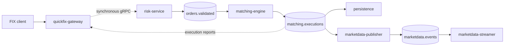

# System Boundaries

This is the canonical target specification for SimpleMatch system topology,
service ownership, and the end-to-end trading flow. It describes intended
architecture; repository contents may be delivered incrementally.

## Planes and ownership

- The **business data plane** carries orders, risk decisions, matching results,
  market data, and queries. Its synchronous ingress and query dependencies use
  gRPC; its ordered, replayable commands and results use Apache Kafka.
- The **operational control plane** carries configuration, scheduling, trading
  pair lifecycle, routing snapshots, and breaker or rate-limit policy. It is
  deliberately outside the trading hot path.
- The **market-reference publisher** owns versioned daily XTAI and ROCO
  reference snapshots. It validates and activates offline source inputs, then
  publishes the durable snapshot event through its outbox; trading modules use
  the active snapshot rather than making exchange-website calls.
- `matching-engine` remains the C++ owner of matching order, fairness, and the
  latency-sensitive deterministic loop. Peripheral services use Java and
  Spring Cloud. The repository remains a polyglot monorepo: Gradle builds Java
  services and CMake builds native services.

## End-to-end data flow

`quickfix-gateway` performs FIX session and message normalization, then submits
orders and cancels to `risk-service` through a synchronous gRPC boundary.
`risk-service` is the first durable business boundary: only after its local
persistence succeeds may the gateway send the first successful FIX response.
After that admission boundary, Kafka carries ordered commands and results to
matching and downstream consumers.

`account-service` is an internal dependency for limits, positions, and optional
reservations. It is not a second ingress path. `query-service`, when present,
reads PostgreSQL or Redis projections rather than Kafka directly.

## Service landscape

| Service | Runtime | Target responsibility |
| --- | --- | --- |
| `quickfix-gateway` | Java, Spring, QuickFix/J | FIX sessions and synchronous admission submission |
| `account-service` | Java, Spring Cloud | Account identity, limits, positions, and reservations |
| `risk-service` | Java, Spring Cloud | Validation, risk decisions, and durable admission |
| `matching-engine` | C++ | Per-instrument order book and matching |
| `persistence` | Java, Spring Cloud | Durable projections, replay support, and audit integration |
| `marketdata-publisher` | Java, Spring Cloud | Market-data event creation |
| `marketdata-streamer` | Java, Spring Cloud | Public market-data and private-notification streams |
| `query-service` | Java, Spring Cloud | Optional internal projection query API |

## Interaction rules

| Boundary | Interaction | Rule |
| --- | --- | --- |
| `quickfix-gateway` → `risk-service` | gRPC unary | Submit the stable `cl_ord_id` / `ClOrdID`; acknowledge success only after durable admission. |
| `risk-service` → `matching-engine` | Kafka | Transfer validated work onto the ordered execution path. |
| `matching-engine` → downstream | Kafka | Publish replayable execution results; downstream consumers own their projections. |
| `risk-service` ↔ `account-service` | gRPC unary | Use deadlines; writes require an idempotency identity. |
| `marketdata-streamer` → clients | gRPC server streaming | Clients reconnect and resume according to the stream contract. |

The detailed protocol fields, compatibility rules, and topic catalog belong in
the cross-cutting contracts area. This document owns the architectural reason
for each boundary, not those wire-level definitions.
