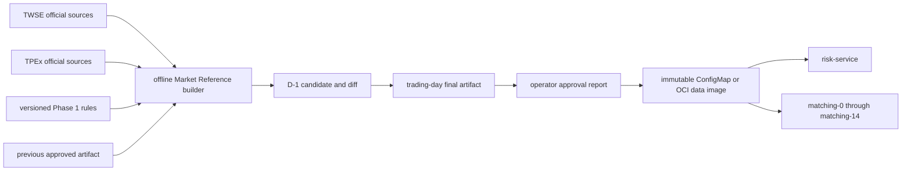
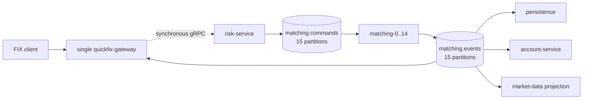

# System Boundaries

This is the canonical target specification for SimpleMatch topology, ownership, and the end-to-end
trading flow. Current implementation status and removal work are tracked separately in the
[Phase 1 Trading Release remaining-work inventory](../../../docs/routing-policy-remaining-work.md).

## Phase 1 Trading Release boundary

The **Phase 1 Trading Release** is the first complete pre-release trading-system boundary. This term
is distinct from numbered implementation phases such as “Phase 1: Consolidate build and dependency
policy” in the refactor plan.

The release supports every eligible XTAI and ROCO regular-board common stock during continuous
trading, TWD only, and all six limit/market plus ROD/IOC/FOK combinations. It includes the complete
FIX admission, Account reservation, deterministic Matching, durable lifecycle delivery, permanent
trade/fill storage, market-data streaming, query/read-model, operational admission, Kubernetes
deployment/security, certification, and pre-release cleanup paths.

A projection or query capability may be non-critical to order admission and Matching without being
optional for release completion. The excluded market products and business capabilities are listed
in the [Taiwan event-driven refactor plan](../../../docs/taiwan-event-driven-refactor-plan.md#out-of-scope).

## Planes and ownership

- The **business data plane** carries synchronous FIX-to-Risk admission and ordered Kafka Matching
  Commands and Events.
- The **operational control plane** carries the approved daily artifact, Kubernetes ownership,
  readiness, session time, operator commands, and admission state. It stays outside the native
  Matching core.
- **Market Reference** is an offline builder. It produces one approved immutable artifact per
  Asia/Taipei trading day and is not deployed as a runtime service.
- `matching-engine` is the native C++ owner of deterministic price-time order books. Java services
  own protocol, admission, account, persistence, projection, and operational boundaries.
- PostgreSQL is authoritative for service-owned account, admission, trade, delivery, inbox, and
  projection state. Kafka `matching.commands` is authoritative only for reconstructing Matching's
  in-memory order books.

## Offline Market Reference flow



The final artifact contains `metadata`, normalized `marketRules`, `marketSnapshot`, and
`routingPolicy`. It covers every Phase 1 eligible XTAI and ROCO regular-board common stock, assigns
each eligible instrument exactly once, and identifies the exact file bytes by trading day and
SHA-256. Risk and all Matching owners load the same mounted path at startup. Missing, stale,
partial, oversized-without-OCI, or mismatched artifacts fail closed.

## Runtime trading flow



The Gateway normalizes FIX, durably records ingress intent, and submits synchronously to Risk. Risk
owns validation, account reservation orchestration, durable admission, the explicit artifact/route
pair, and outbox publication. New-order and cancel commands enter the partition selected by the
artifact; Open and Close Barriers are written once to every partition.

`matching-N` explicitly owns partition `N`; Kafka group rebalance never moves it elsewhere. The
single-writer core owns at most 150 instrument order books and emits deterministic Matching Events.
Persistence, Account, and QuickFIX are independent critical consumers. Market-data projection is
rebuildable and non-critical.

## Runtime service landscape

| Capability | Runtime | Target responsibility |
| --- | --- | --- |
| Offline Market Reference builder | Repository CLI/tool | Official-source acquisition, validation, stable routing, canonical artifact, and approval evidence |
| `quickfix-gateway` | Java, Spring, QuickFIX/J; one Phase 1 replica | FIX sessions, durable ingress, synchronous Risk submission, durable execution delivery, and operational admission |
| `risk-service` | Java, Spring | Artifact validation, order/cancel admission, Account reservation orchestration, and `matching.commands` outbox |
| `account-service` | Java, Spring | Cash/position/reservation authority and critical Matching Event application |
| `matching-engine` | Native C++; 15 StatefulSet replicas | Partition-owned deterministic order books, replay, and Matching Event publication |
| `persistence` | Java, Spring | Permanent immutable trades, order-fill legs, order projections, and critical inbox |
| Market-data projection | Java, Spring | Rebuildable last-trade and top-five order-book views |
| `marketdata-streamer` | Java, Spring | Public market-data and authorized private streams |
| `query-service` | Java, Spring | Required read-only PostgreSQL/Redis projection API for order, execution, account-summary, and active-market-reference views |

Market Reference is not a target runtime service. The offline
`tools/market-reference-builder` owns normalization and validation; Risk and Matching consume the
approved daily artifact. There is no runtime database, outbox, connector, or Market Reference
topic.

## Operational admission

The single Gateway owns the Phase 1 admission state machine but receives technical facts through
adapters rather than importing Kubernetes or Kafka types into domain logic.

```text
RiskStatus
MatchingFleetStatus
CriticalConsumerStatus
KafkaStatus
        |
        v
TradingSystemStatus
        |
        +-- OPEN_ELIGIBLE
        +-- PAUSE_REQUIRED
        +-- INTERRUPT_REQUIRED
```

`open` requires all 15 Matching owners, the exact artifact/session/schema/algorithm identities,
complete recovery, no quarantine, and critical-consumer health. Ordinary unavailability or lag
pauses new orders while cancellations remain available. Identity or deterministic-payload conflict
interrupts both. Recovery never reopens automatically.

## Interaction rules

| Boundary | Interaction | Rule |
| --- | --- | --- |
| FIX client -> Gateway | FIX 4.4 | Normalize protocol fields and preserve FIX business identity before Risk submission. |
| Gateway -> Risk | gRPC unary | Acknowledge durable admission only after Risk's local outcome commits. |
| Risk -> Matching | Kafka `matching.commands` | Publish stable command identity to one explicit partition; never default-route or recompute recovery routes. |
| Matching -> downstream | Kafka `matching.events` | Publish deterministic at-least-once results; consumers own durable idempotency. |
| Risk <-> Account | gRPC unary | Use durable idempotency and never hold a cross-service database transaction. |
| Gateway adapters -> operational APIs | Kubernetes, Kafka, internal status | Translate technical facts into domain status; do not create a second command path. |
| Streamer -> clients | gRPC streaming | Reconnect, resume, and resynchronize according to the stream contract. |

Wire fields and topic rules belong in the [Kafka contract](../contracts/kafka-events.md), FIX
semantics in the [FIX contract](../contracts/fix-gateway.md), and current implementation evidence in
the remaining-work inventory.
